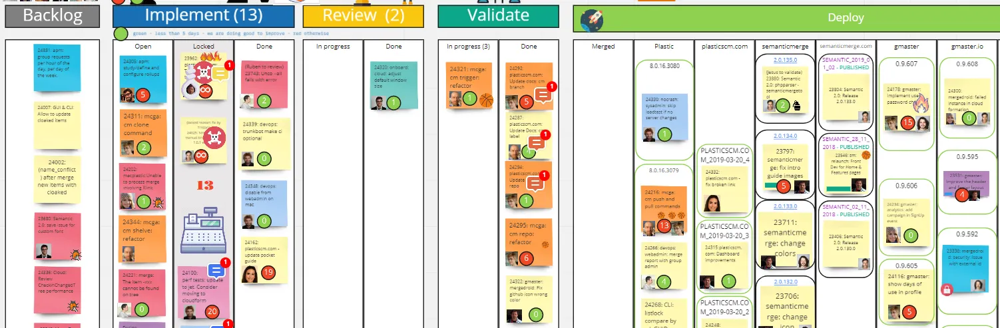
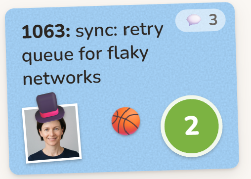
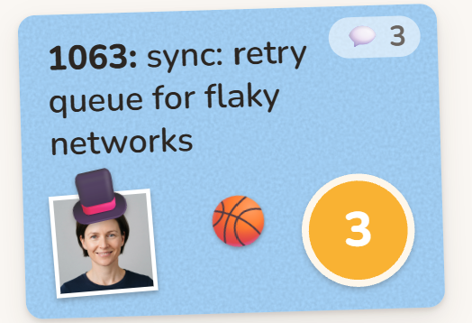
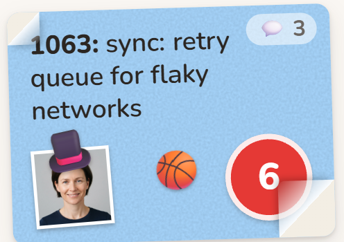
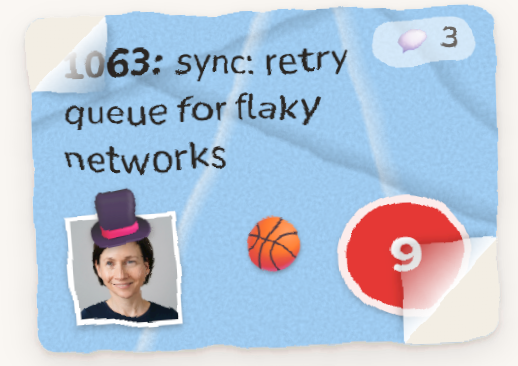
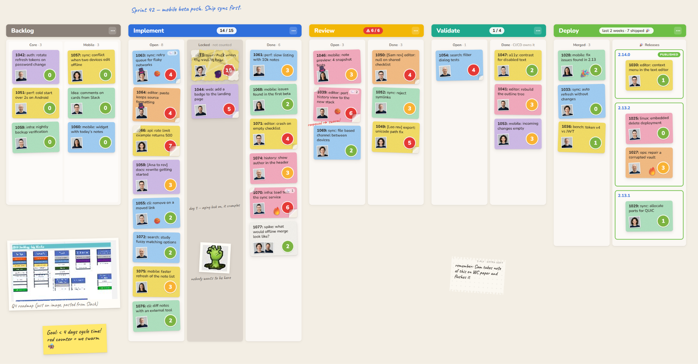
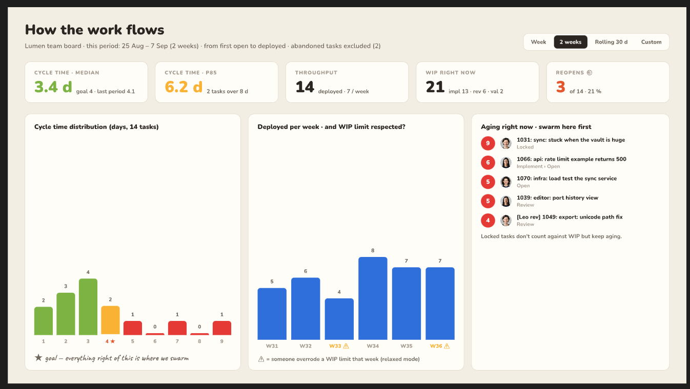
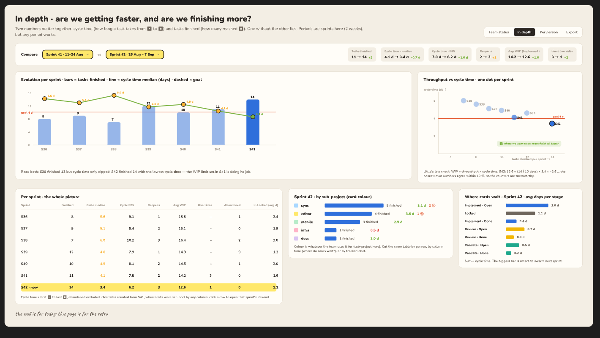
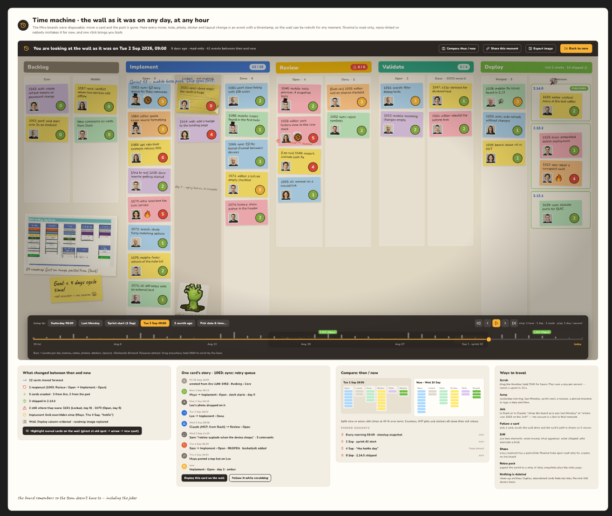

I did scrum forever [then switched to kanban](/posts/from-scrum-to-kanban-how-we-delivered-tasks-twice-as-fast/). But I hated all the tools so we used a simple Miro board to track our tasks.

Yes, it was manual, but it had something most customized Jiras and Linears can't do:

1. A number on each card telling you how many days the task is open. This gives you an idea of how the cycle time is going.
2. It was *human,* vibrant, with icons, colors, jokes, hats on people's photos, random funny icons… not just a cold table like what you can find in Jira, which I can't stand.

At a glance you could see what tasks were taking too long (according to what the team had agreed 'a good cycle time' was). And you also saw how much work you deployed in the last period, all building a sense of progress.

I loved it, and I miss it. I've been through Linears and Jiras and yes, they are better issue trackers than my old beloved TTS, but their kanbans are horrible. (TTS was a custom in-house little PHP thing that was simply 3 times faster than all those, and that could have a second life now with agents, but it is probably sitting forgotten somewhere by now.)

# You're doing kanban wrong

Here I am, with a click-bait title.

Yes, all kanbans I see put cards there but they forget about the only two things that matter:

* Cycle time: how long a card takes from open to deployed.
* Work in progress limits: to make sure we swarm together when needed to move tasks forward.

Without that, you're putting cards on a board, great, but that's not what kanban is about, and you're probably missing most of what makes it good.

# Boards must be fun, and human

This is the life of a card that I like:

| It's been open for 2 days, and reopened once (the basketball icon means 'rebounded'). | It's close to the 4-day goal limit, so numbers turn orange (I used to do this manually in my Miro) | Too many days pass, so it starts 'deteriorating' | Open for too long, it simply looks like scratched paper (I didn't have that in my Miro) |
| :---- | :---- | :---- | :---- |
|  |  |  |  |

This is my type of process. Solid, repeatable, super controlled, but also visually rich, and with a human touch.

And I believe the *human touch* is now more important than ever in the agentic age. With all code written by AI, you can probably place the tasks in the board just automatically through MCP, yes, but when you look at the board, you need to remember there are humans involved, I guess, I hope.

So, I like a kanban board that allows me to put icons, photos, a link to the roadmap, or a photo of the roadmap like the one on the bottom left in the following screenshot:

# Does kanban still make sense when you do 3 tasks in parallel with agents?

I don't know. Maybe it doesn't. Keeping things under control and understanding what the rest of the team is doing probably is still worth it, even with tons of agents around. So that's why I still think we need a better kanban board, integrated with Linear, Jira, GitHub issues, PRs, but fun to use, super visual, not rigid, fast, and capable of providing great stats.

As a bonus, I'd like my board to let me go back in time and see how things were one month ago, just to get more context:

Let's see if this is worth building.
