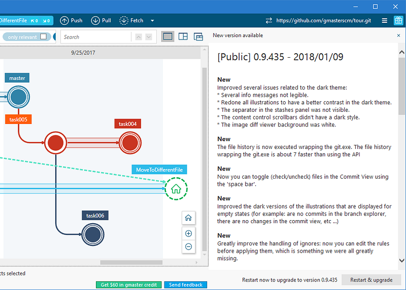
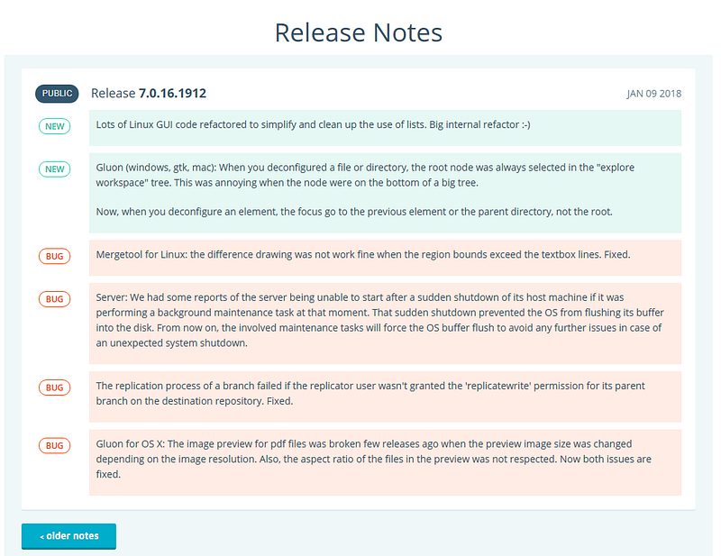

> *This post was originally published on [Medium](https://medium.com/@psluaces/como-escribir-release-notes-2256cf8aff5c).*

Las release notes son el punto de entrada de nuestros usuarios a una nueva característica. Deberíamos escribirlas de modo que sean cómodas de leer, con frases cortas, destacando lo más importante al principio, con ejemplos en lugar de abstracciones, y hacer que la escritura sea parte del proceso de trabajo diario.

Voy a contar cómo escribimos release notes en Códice para nuestros diferentes productos, cómo hemos evolucionado, las cosas que hacíamos mal y que tratamos de hacer mejor, y lo que pensamos mejorar.

### Sin release note no hay feature

Supongo que es obvio, pero como desarrolladores tendemos a olvidarlo. No importa cómo de importante sea un bugfix o una nueva característica si no tiene una buena explicación que el usuario pueda encontrar y entender.

Los dos puntos son clave: que pueda encontrarlo (link desde la aplicación, desde downloads, etc.) y que pueda entenderlo. Tendemos a escribir mensajes crípticos que casi pretenden ocultar qué ocurre más que explicarlo. Pensemos que esto va dirigido a un usuario, hablemos su lenguaje.

### Reglas para escribir una buena release note

Las reglas que nosotros intentamos seguir en Códice tanto para Plastic, Semantic y gmaster son:

-   Ponte en los zapatos del usuario: ¿entenderías la release note sin ser parte del equipo de desarrollo? Si es que no, explícalo mejor.
-   ¿Puedes poner un ejemplo? Hazlo. Al parecer, el cerebro humano es mucho mejor generalizando a partir de ejemplos concretos que extrayendo ejemplos concretos de generalidades. Y lo curioso es que nuestro impulso es justo el contrario: intentar escribir textos genéricos que son más difíciles de hacer y de entender (quizá viene de escribir textos formales en la universidad).

Se entiende mejor, claro, con un ejemplo :-): es más fácil de entender “cuando creas la rama hija main/task127, modificas foo.c y haces merge a main, da un mensaje de error” que “se produce un error inesperado al hacer un merge de un ítem desde una rama hija con un fichero modificado”. Es mejor hablar de “foo” y de “task127” que de abstracciones, tanto al leer como al escribir.

Esto ayuda mucho también al hablar de ficheros de configuración. Es mejor decir “el formato de ignore.conf es:

Que “introduzca en cada línea del fichero de configuración un patrón del tipo de fichero a ignorar”.

Para mí lo de los ejemplos es una regla de oro tanto en release notes como en manuales, blogposts e incluso comunicación con clientes.

-   Escribe frases muy sencillas, en presente o pasado, sin tiempos compuestos. Esto aplica muy bien al escribir en inglés. En castellano tendemos a querer usar pasivas, o perfecto simple “ha ocurrido” en lugar de “ocurrió” o incluso “ocurre”. Ejemplo: “An issue happens when you click ‘process all merges’” es mejor que “We detected that issues have been occurring when ‘process all merges’ is clicked” (un poco forzado, pero creo que se ve la idea). Al final: siempre “I went” en lugar de “I have been”, y siempre mejor presente que pasado o futuro, si es posible.
-   Cuenta de qué va en la primera frase, resumido, y luego ya das más detalles. Éste es un buen consejo de [Everybody Writes](https://www.amazon.es/Everybody-Writes-Go-Creating-Ridiculously/dp/1118905555): lo más importante al principio del texto, y lo mismo aplica a cada frase. Tendemos a querer que el lector recorra nuestro mismo proceso de pensamiento, descubriendo lo importante al final. Los textos técnicos no son novelas de misterio, así que es mejor contar al principio lo importante, asegurarte de que enganchas al lector, y luego ya contar los detalles, si le interesan (esto mismo lo aplicamos, o intentamos, más bien, a docus de diseño, blogposts, docu, todo).
-   No te cortes con la longitud. Si es breve, mejor; pero si para entender una nueva característica tienes que poner un fichero de configuración y un par de casos, hazlo.

Ahora mismo en las release notes no metemos imágenes, algo que hicimos con la intención de mantenerlas lo más sencillas posible. Sin embargo, creo que en otros productos ya he visto capturas y diagramas porque usan un formato tipo wiki o similar para editarlas y mostrarlas. Así que creo que será un camino a seguir. Está claro que nada tendrán ya que ver con la idea de release note en un simple txt, pero si el objetivo es explicar al usuario qué hay de nuevo, mejor no escatimar.

Nuestro caso también es especial porque el usuario es alguien como nosotros, un programador la mayoría de las veces, y por tanto debería ser fácil ponerse en su piel. Así que explicaciones oscuras tipo “en ciertas circunstancias el diff puede lanzar una excepción” le van a servir de poco y pensará que no le queremos contar algo, o que no lo sabemos, y la explicación no le valdrá para nada. Está claro que hoy por hoy un desarrollador prefiere que le cuentes qué ocurre, aunque sea un error feo, que una evasiva.

### ¿Quién las escribe? — uno para todos, todos para uno

Durante años parte del proceso del “integrador” (el que hacía los merges y creaba nuevas releases, antes de [automatizar mucho más el proceso](http://blog.plasticscm.com/2017/04/how-we-do-trunk-based-development-with.html)) era escribir las release notes de cada tarea que integraba. Un cuello de botella más en el proceso, y un dolor para él. Cierto que al menos teníamos a alguien responsable de toda la escritura y de que todo tuviera sentido. Pero era mucho trabajo entender y sintetizar todas las tareas mergeadas sin saber a veces bien de qué iban.

Así que cambiamos el proceso: ahora el autor de la tarea se encarga de escribir unas buenas release notes, y el revisor les echa un ojo para ver que tengan sentido y sean entendibles.

Esto es lo que vemos en nuestro issue tracker cuando cerramos una tarea:

Así que escribirlas es ahora parte de la tarea, de modo que el trabajo pasa a estar distribuido entre todos, lo que agiliza el proceso de release.

### Recopilación automática

El programa de publicar releases busca en el issue tracker las release notes de cada tarea integrada que se escriben en un formato concreto, muy sencillo, y las sube a la web junto con los nuevos binarios.

La web puede leer las release notes, parsear su contenido buscando tipo \[new\] o \[bug\] en los textos, y renderizarlas correctamente.

En el caso de gmaster además de la web, el mismo proceso se hace en la aplicación, que descarga las release notes y las muestra en HTML cada vez que detecta un upgrade.

De este modo, una vez escritas y revisadas, el resto del proceso es automático sin necesidad de que nadie tenga que sufrir el ir copiando y pegando fragmentos de texto de cada tarea.

### Sirven de ayuda para crear documentación técnica

Como programadores siempre tenemos la tendencia a pensar “bah, esto ya lo documentará el que hace los manuales”. Y efectivamente puede ser cierto, pero:

-   Dos minutos tuyos escribiendo la release note pueden ahorrar entre 20 y 60 minutos al escritor técnico que se encarga de actualizar la documentación. Se lo dejas lo más claro posible para que vaya a tiro fijo (aquí nosotros no solamente nos basamos en la release note, cada tarea lleva una explicación de solución y lo suyo es que intente hacer la vida lo más fácil posible a los que vengan detrás; en teoría, al menos ése es el objetivo).
-   Es posible que la release se publique antes de que la documentación esté lista, sobre todo cuando haces varias releases semanales como en nuestro caso. La release note va a ser la única forma de que los usuarios se enteren al momento de las novedades.
-   Sirven para ir generando contenido de newsletters, redes sociales, blogposts, etc.

### ¿Dónde se muestran las release notes?

Nosotros pasamos de hacer release notes en un fichero de texto que solamente se veía pulsando un botón durante la instalación, a convertirlo en algo central en cada versión.

En el caso de gmaster las release notes se muestran al anunciar cada update, dentro de la propia aplicación:

La aplicación es capaz de mostrarte no solo qué hay de nuevo en la versión que te descargas, sino todas las novedades entre la versión instalada y la que te propone descargar. Vamos, que no es muy difícil implementarlo si los datos se guardan con un poco de estructura. En nuestro caso muy sencillo: ficheros con el nombre de la release (0.9.434, 0.9.435, etc.) y que llevan dentro las novedades y bug fixes precedidas de \[New\] o \[Bug\] en cada caso. El servicio web recibe el número de versión del cliente y compone una respuesta con todas las release notes que le faltan hasta la última versión publicada.

Y en Plastic tenemos una sección en la web en la que se pueden ir navegando, aunque el objetivo es mostrarlas también dentro de la aplicación al anunciar updates.

### Qué tenemos previsto mejorar

Como decía antes, posiblemente poder añadir imágenes, de modo que cada nueva release sea casi un breve blogpost muy explicativo. Además de eso, tenemos que seguir mejorando la redacción y, especialmente en Plastic, avisar de nuevas versiones mostrando qué hay de nuevo.

Espero que haya servido de ayuda si tu equipo también pretende distribuir la escritura entre todos los desarrolladores.
