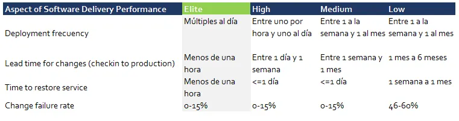
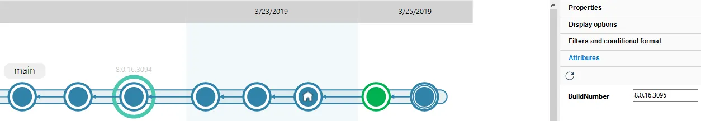

> *This post was originally published on [Medium](https://medium.com/@psluaces/devops-como-es-la-elite-314290d4ebcf).*

¿Cómo son las organizaciones de desarrollo de software más punteras en 2019?

Supongo que a todos nos gustaría comparar nuestra forma de trabajar con otros equipos para saber dónde estamos. Lo que pasa es que la conversación suele ir por un camino más bien subjetivo en vez de comparar números.

Bueno, pues esto cambia gracias a “[Accelerate State of DevOps Report](https://cloudplatformonline.com/2018-state-of-devops.html)”. Contiene información suficiente como para saber si eres parte de lo que llaman “la élite de DevOps”.

### Análisis completo del informe

Nicole Forsgren, Jez Humble y Gene Kim explican el informe con mucho detalle en el libro “[Accelerate: The Science of Lean Software and DevOps: Building and Scaling High Performing Technology Organizations](https://www.amazon.es/Accelerate-Software-Performing-Technology-Organizations/dp/1942788339)”.

Jez Humble es también el autor de mi libro favorito sobre DevOps: “The DevOps Handbook: How to Create World-Class Agility, Reliability, and Security in Technology Organizations”. Muy fácil de leer y te cuenta muchas anécdotas y datos de cómo funcionan empresas punteras como Amazon o Google. De hecho, tras leer ese libro aquí en Códice nos decidimos a productizar nuestro ciclo de “bots” y lanzamos los mergebots como parte de Plastic SCM: [https://www.plasticscm.com/mergebot-devops](https://www.plasticscm.com/mergebot-devops)

### Frecuencia de deployment

El informe dice: _para la principal aplicación o servicio en la que trabajas, con qué frecuencia pone tu organización código en producción?_

Vamos, qué cómo de frecuentes son tus deploys. Y parece que las organizaciones más avanzadas lo hacen varias veces al día (el DevOps Handbook explica esto muy bien en detalle).

El significado de “deploy” puede variar mucho dependiendo de tu industria, claro. Para nosotros en Plastic SCM significa publicar nuevas versiones, y lo solemos hacer una vez al día. Bueno, hay un pequeño “pero” aquí. Generamos versiones “potencialmente entregables” al menos una vez al día, pero como no queremos abrumar a los usuarios, publicamos solamente una o dos veces a la semana.

La técnica que usamos es la siguiente: cada rama de tarea/bug se integra (merge) en main una vez ha sido revisada, validada y ha pasado todos los tests automáticos. Entonces la nueva versión potencialmente entregable se marca con un build number pero usando un atributo en lugar de un label:

Las versiones que realmente lanzamos sí que las etiquetamos (círculo verde, que es como Plastic muestra las labels).

Hacemos esto (y recomendamos lo mismo a los equipos que usan Plastic), a través de task branches + trunk-based development. Brevemente:

· Todo es una tarea en tu issue tracker (tanto bugs como nuevas features, refactors, cualquier cosa).  
· Se crea una rama para cada tarea.  
· La intentamos terminar en 2–3 días (y esto, por supuesto, quiere decir que hay que dividir el trabajo correctamente en tareas, lo que es todo un arte).  
· Cada task branch la revisa otro miembro del equipo.  
· Cada task branch se valida (alguien hace un test manual rápido). Esto es opcional dependiendo del proyecto, pero a nosotros nos gusta porque intentamos asegurarnos de que el cambio tiene sentido desde el punto de vista del usuario.  
· Cada task branch (rama de tarea) pasa todos los tests automáticos. Montones de tests unitarios, unos pocos tests de integración, y todavía menos de GUI. La clave es mantener los tests sencillos, estables y rápidos. Los tests lentos no te permitirán llegar a la élite.  
· Las ramas de tarea se integran (merge) en main solo si los tests pasan.  
· Cada nuevo cambio en main es entregable.

### Lead time

El estudio dice: _para tu principal aplicación o servicio, ¿cuál es el “lead time” de un cambio? (es decir, ¿cuánto tardas desde que haces un checkin/commit hasta que ese código está funcionando en producción)._

Imagínate el cambio más sencillo posible en tu código. Tocas tan solo una línea. ¿Cuánto tarda ese cambio en llegar a producción?

A ver, puede sonar sencillo, pero es que ese pequeño cambio debe pasar por todo el ciclo. Tiene que revisarse, probarse, y ponerse en producción.

En DevOps es siempre clave la automatización. Y en este caso, para alcanzar los números de “la élite”, es imprescindible.

En nuestro caso todavía no estamos ahí porque lo mínimo que tardamos son 2 horas hasta que un cambio llega a una versión lista para publicar. Y esto es porque nuestros tests han crecido demasiado y, a pesar de que paralelizamos mucho, todavía tardamos 2 horas. Quizá con más fuerza bruta y más paralelización podríamos bajarlo, pero el problema de verdad es que los tests de integración y gráficos tardan demasiado, porque tenemos demasiados.

Publiqué hace poco un post en el que hablo de “cycle time y lead time” y cómo cambiamos nuestra forma de trabajar al movernos de Scrum a Kanban: [De Scrum a Kanban: cómo entregamos tareas el doble de rápido](/posts/de-scrum-a-kanban-como-entregamos-tareas-el-doble-de-rapido/)

### Tiempo para restaurar el servicio

_Para tu principal aplicación o servicio, ¿cuánto tardas normalmente en restaurar el servicio cuando se produce una incidencia? (por ejemplo, que se va la luz, un bug crítico, etc)._

Este es un requisito puramente de “operaciones”. ¿Cuánto tardas en restaurar el servicio cuando algo va mal? El objetivo para ser tan bueno como lo que el informe llama “élite” es que sea menos de 1 hora.

Creo que para muchos equipos que hacen software cloud esto no va a ser un problema hoy en día. Quiero decir, que los proveedores tipo Amazon, Azure, etc, suelen darte mecanismos para hacer deploys rápidos. Eso sí, la cosa cambia si trabajas en software embebido, o videojuegos, o muchos otros (aunque en el caso de los juegos online, la importancia del servicio y el continuous deployment es también parte de la ecuación hoy por hoy).

### Porcentaje de cambios que provocan fallos

O “change failure rate” que es más corto.

_Para tu aplicación o servicio principal, ¿qué porcentaje de los cambios resulta en un servicio degradado o requiere nuevos cambios para remediar el problema introducido? (Ejemplo: servicio que deja de ir bien, que se para, que se requiere un hotfix, un rollback, un nuevo fix, un parche)_.

Vamos, que cuántas nuevas releases rompen el sistema.

Creo que aquí el principal problema es trazar correctamente estos fallos. Para los equipos trabajando en SaaS es probable que sea muy sencillo, pero para equipos con software más tradicional que hacen deploys diferentes, puede ser más complicado.

