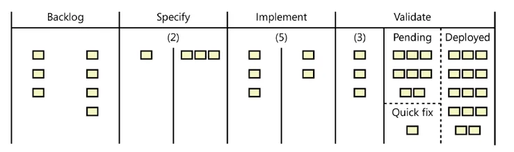
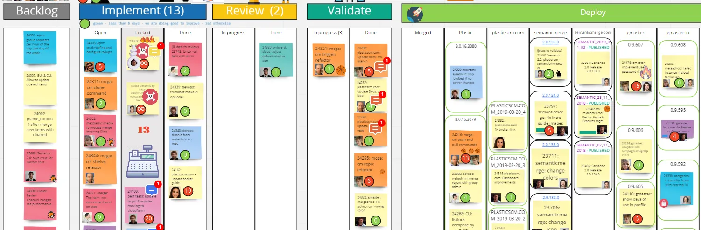

> *This post was originally published on blog.plasticscm.com, but that source is now lost. The Spanish version is available [here](/posts/de-scrum-a-kanban-como-entregamos-tareas-el-doble-de-rapido/).*

We cut in half the average time it takes for a task to go from open to production. From 7.52 to 3.66 days.

And this is the story of what we did to achieve it.

Don't expect magic recipes. We simply focused more on moving forward as a team and less on individual plans.

### Context: 300 sprints and 13 years with Scrum

We had been using Scrum for 300 sprints and over 13 years. While Scrum was good, it somehow stopped working for us. So we thought we could put more emphasis on collaborating as a team and decided to move to Kanban.

### The book that changed everything

A few months before making the switch, we read a few books about Kanban.

But there was one we particularly liked.

It was "Agile Project Management with Kanban" by Eric Brechner (who actually has other really good books too).

Honestly, I no longer know if a book is truly good or bad, or if it just depends on the moment it catches you. In any case, this one arrived at the right time, at least for me.

Brechner's book explains Kanban in a very practical and analytical way. And that's exactly what I liked about it. It's not so much about praising collaboration in an almost mystical way like others do — it gets straight to the point.

### What Kanban is about — at least in my head

When you say Kanban, the first image that comes to mind is usually a board with sticky notes.

Well, for me it's no longer just that.

Kanban is about limiting work in progress (WIP).

It limits the number of open tasks, and the entire team will focus on moving them forward so new ones can come in, rather than on their individual plans.

### Cycle time vs lead time

The book explains this very well.

"Cycle time" is the time from when you open a task until it goes into production.

"Lead time," however, is the time from when the task or bug enters the system.

We haven't focused on measuring lead time, although we do consider it in support.

### Tools

Of course, we use Plastic SCM as our version control system and use "branch per task" to implement each task (and we have a free book you can download as PDF or read online that's exactly about this: "Version Control, DevOps and Agile Development with Plastic SCM": [https://www.plasticscm.com/documentation](https://www.plasticscm.com/documentation)).

We also use our own task manager (which is older than the company itself) for every bug and every new feature (we don't write a single line of code without an associated task).

But yes, we needed a good tool to set up the Kanban board.

These are the ones I evaluated:

**Jira**

[https://www.atlassian.com/software/jira/features](https://www.atlassian.com/software/jira/features)

Price: $7/user/month

It has WIP limits — [https://www.atlassian.com/agile/tutorials/how-to-do-kanban-with-jira-software](https://www.atlassian.com/agile/tutorials/how-to-do-kanban-with-jira-software)

But I didn't see that it supported multiple columns, which is something Brechner recommends.

**Kanbanflow**

[https://kanbanflow.com](https://kanbanflow.com/)

Free (limited). $5/user/mo (more features, analytics, integrations)

It also has WIP limits.

I asked them if they could do the multi-column thing but it seems they couldn't.

**Kanbanize**

[https://kanbanize.com/software-development](https://kanbanize.com/software-development)

$148/mo for up to 15

Their website seemed unclear to me.

**Leankit**

[https://leankit.com](https://leankit.com/)

$19/user/mo or $32/user/mo

I didn't like their web interface.

It seems to be one of the few that can do multi-column WIP limits.

**Kanbantool**

[https://kanbantool.com](https://kanbantool.com/)

$3.5/user/mo or $6.5/user/mo

I'm not sure if it can do WIP limits.

**Kanbantree**

[https://kantree.io](https://kantree.io/)

7 eur/user/mo

It seems to be a small French company, which I really liked.

But I don't see that they have the multi-column thing.

**Realtimeboard — now Miro**

Well, in the end we went with Realtimeboard (which just rebranded to Miro a few weeks ago). It's not actually a Kanban tool, and it doesn't provide any advanced features to enforce WIP limits, and it's even more expensive than the others.

But... I liked it much more, for a few reasons.

This is the board layout the book suggests:

It recommends setting WIP limits that affect two or more columns within the same phase.

Look at the "implement" phase: it has two columns. The first one means open tasks, and the second means tasks that are done being implemented (and ready to move to the next phase). However, the limit for both is 5.

That means you could have 3 open tasks, but if there are 2, like in the diagram, ready to move to the next phase, then you can't add more.

The work-in-progress limit affects both "open" and "done" at the same time.

Almost all the tools I reviewed couldn't do this. They all seemed focused on setting the WIP limit per column, but then you don't achieve the same effect. That is, a WIP of 3 on "implement-open" and another of 2 on "implement-done" is not the same as a global limit of 5 affecting both columns.

This seemed very important to me, and that's why I didn't propose any of the other tools.

Besides, Realtimeboard/Miro gives us a lot of flexibility. It's the closest thing to having a physical board, because we're quite distributed and a whiteboard wasn't going to work. Sure, it doesn't come with any automation of any kind, we have to move the cards ourselves... but isn't that exactly what Kanban is about?

A few weeks after moving to Kanban we also switched to Basecamp for all our internal communication. We drastically reduced our use of Slack (the biggest source of interruptions known after a ringing phone) and also email, and now we have a great place to discuss new features and bugs and everything gets recorded. We can drop a link to a Basecamp conversation in our issue tracker when we finally decide to implement something we had been discussing. Just this, as simple as it sounds, is amazing, because you don't get the same thing if the discussion is over email. We also evaluated Twist, but in the end we stuck with Basecamp.

### Our Kanban board

So this is what our Kanban board looks like in Miro (Realtimeboard).

We made a few changes from what the book proposed, but in essence it's the same.

- **Backlog**. We don't set WIP limits for the backlog and we also don't split it into "in progress" and "specified." We did that for a few weeks, but it didn't fit us so we eventually removed it. We have room for improvement here.

- **Implement**. Three columns: open, locked, and done. Locked should be an exception: it should only contain tasks that can't progress for a good reason. There should be few of them and they don't count toward the WIP limit. To be honest, sometimes, like in the screenshot, we abuse it a bit, to everyone's frustration. The "open" and "done" columns are very clear: tasks in progress or completed but pending review and validation.

- **Review.** We review every task, and we split the phase into "in progress" and "done." Both count toward the WIP limit.

- **Validate.** Only "in-progress" counts toward the WIP limit. It basically shows tasks being validated *right now*.

- **Deploy.** This one has grown the most. We have an initial "merged" column which means the task has already been integrated into main but is not yet part of a release. The cycle time is still running. Then we have a "deploy" column for each of the products we maintain: Plastic and the plasticscm.com website, Semantic with its website, and gmaster with its website. Once they're in deploy, the cycle time stops counting.

Once a task reaches "validate done" it goes into automatic mode. A mergebot ([https://www.plasticscm.com/mergebot-devops](https://www.plasticscm.com/mergebot-devops)) takes care of merging into main (and placing that merge in a temporary location), launching the build, running the tests, confirming the merge (from that temporary location), and preparing the new version for release.

Any of those automated actions could fail, and if they do, the task goes back to "implement open."

We make all those state changes manually, in a collaborative way (the first one who sees it, moves it). Sure, yes, it's a pain sometimes, but it forces us to stay alert and up to date with what's going on, which is exactly what we wanted.

I'm not going to explain here how we calculated the WIP limits because that's another blog post in itself, and besides, Brechner's book explains it very well.

What's probably worth explaining is how we use the cards:

### What motivated us to change?

When I founded Códice back in 2005, I was already a believer in Peopleware. This means we even set up the office according to what the book recommended. A minimum of square meters per person, lots of quiet, no cubicles but also not going overboard with open spaces.

This is a floor plan of our office in Boecillo.

Just as I tried with the code and with everything else, it was my chance to "do things right."

Of course, I made a lot of mistakes, but I think with the office it turned out fine.

And one of the things Peopleware recommended was to find a good way of working.

So Scrum came to the rescue. For me, being under 30 and with about 5 years of experience, it was great. I had read Schwaber's book "Agile Project Management with Scrum" and we started applying it immediately. Two meetings at the beginning, task list, the daily, review, and retrospective. Basically, you go from zero to having the team busy and organized in no time. I loved it.

For a couple of years we went back and forth on sprint duration. We started with 4 weeks, but after the second week we always changed plans. So we finally settled on 2 weeks per sprint and have been measuring time that way ever since. For over 12 years. And we still use "sprints" to know where we are even though it doesn't make as much sense in Kanban.

What went wrong? Well, I wouldn't say there's anything broken with Scrum. It was us, not Scrum :P.

- A release at the end of the sprint always felt weird to us. From almost the beginning we tried to do at least one release per week, and the goal was to do many more. This means that even when we were fully into Scrum, the end of the sprint didn't mean much either.

- At first, the whole sprint planning thing was great. But a few years later, with a less homogeneous team (which isn't a bad thing!), some discussions about what came first and what came next made less sense. I mean, everyone always had a say — it's not that — but there were topics we had covered so many times they didn't warrant another conversation. We've gone back and forth on this recently, trying more and less discussion over time.

- Retrospectives and reviews were great at first. We kept notes from all of them, neatly organized in our internal wiki. But many, many months later it started to feel like bureaucracy. It was mandatory. Yes, the problem was definitely us, but we were more eager to get work done than to have philosophical discussions every two weeks. Maybe the sprint length was wrong.

- We never implemented velocity. We always estimated in "ideal days," never in story points. My fault. I own it, but the reality is we never did it.

- We optimized everything for individual productivity. Look, that's a good thing. Minimizing noise (I'm also a big fan of "Pragmatic Learning and Thinking" and the authors insist that wearing headphones kills creativity — that's why I always want the workspace to not have too many people, and to be as quiet as possible. Listening to music should be an option, but not mandatory so people don't bother you), reducing interruptions (notifications disabled, don't interrupt people at their desks), meeting rooms outside the work area, and all that.

I'm going to dig a bit deeper into the "productivity" point because it's probably the main reason why we needed to change.

Add a whole decade to those ideas about collaboration, and eventually we became masters of "being in flow." But then something got out of hand...

"That's not in my plan."

I'm lucky to have a team full of people who are always happy to help and who have been working together for many years (we still call "new" those who've been here for 5 years!).

I've always tried to do everything possible to follow those Peopleware rules, but the downside is that at some point we started prioritizing individual plans over team plans.

At the beginning of each sprint, everyone had their task list. Creating that list became a real pain too, and I'll talk about that later. That task list was THE sprint goal. It's not that anything happened if we didn't finish the list — many times we didn't — but it was what we aspired to.

And understanding what was important at a global level became increasingly difficult. That is, everyone was working on their list and maybe was deep into their task instead of helping someone else with a more important one.

Of course, I can't say this was Scrum's fault — it was mine. But it's what happened.

One more thing about those tedious "task lists." In our quest for maximum individual productivity, we started to see meetings as a necessary evil. And we probably went too far. We always held planning meetings when needed, but in the end I was in charge of preparing a task list for everyone, with help from a few team members. This saved a lot of "administrative" work for everyone. Of course, everyone always understood the overall direction, but most were spared the bureaucratic work. Was it good? I don't know, but the fact is that the time spent on planning started to grow.

A quick calculation of total hours spent on "planning" in Scrum: 4 hours max of planning meetings + 1 hour of review and another hour of retrospective at the end = 6h x 10 people = 60h of planning every two weeks for a team of 10.

The truth is we never reached the maximum of 60 hours, but we were often at 30–40 and we considered it terrible. Maybe we're exaggerating, but we didn't like it at all.

So we tried to find a better way of working.

Oh! One more thing! Most of the team hates daily meetings. We started doing them first thing in the morning ages ago. But "first thing" varied a lot, especially at the beginning, when some (twenty-somethings at the time) arrived at 10:30. As the years go by, it seems everyone prefers to arrive earlier and leave earlier too. Anyway, we eventually moved "first thing" to "whenever possible" and finally standardized it to "before lunch." And we stuck with that for years. And it seemed to work. We did everything we could to keep it to 15 minutes max. And although there were some bad years, in 2017 and 2018 we shortened them a lot and stayed within those limits.

In any case, we kept doing them because... well, because it seemed like the right thing to do. But many times we didn't fully listen, or the explanations were poor. We tried to do everything possible to communicate better.

But in the end, they were still meetings, and we don't like meetings, so when we moved to Kanban we stopped doing them.

### How did we make the switch?

I re-read Eric Brechner's book in detail and prepared a presentation to explain everything to the team, highlighting what I considered key. On the first day of Sprint 294, I gave the presentation to everyone and then we spent a few hours calculating the WIP limits together. The Realtimeboard was already set up.

And that's it. We just started using it. The first week we already liked it, and by the second week the cycle time was already better than in the last Scrum sprints, and it hasn't gotten worse since.

### What went well?

More work completed, fewer meetings, less time spent on "planning stuff" (from 30–40 hours per sprint to just 5 hours in many of the new ones, with peaks of 20 hours that we now consider horrible when before it was normal).

The feeling of progress, momentum, and teamwork is much better when we collaborate on moving tasks forward.

### What needs improvement?

The first thing that comes to mind is the Backlog column. Yes, we have a solid roadmap, and lists and everything, but we can do better on the Kanban board.

### Numbers!

I've compiled some numbers (thanks to our issue tracker) from the last Scrum sprints and the most recent Kanban ones to compare:

"Cycle time" is the time in days from when a task is started until it's in a release.

"Net cycle time" is the same, but excluding weekends (more realistic, less pessimistic).

The most notable comparison between the last 4 sprints (2 weeks each) of Scrum and the 4 most recent of Kanban:

- We reduced the average net cycle time from 7.52 days to 3.66. That's being 2x faster.

- Counting weekends (cycle time), we went from 9.38 to 4.40 days. 2.1x faster.

If you notice, it's not that we do much more work — we just organize it differently.

Other numbers I find very interesting are those for time spent on planning tasks. They can be seen in the following table:

SPRINT 294 was the first Kanban sprint.

Hours spent on planning in the last 14 Scrum sprints = 440h (5% of total work time).

Hours spent on planning in the following 14 Kanban sprints = 180h (3% of total work time).

So we basically cut bureaucracy in half.

And this doesn't count the time from "daily standups," which we also don't usually do anymore (everyone reports what they did at the end of the day on Basecamp in something they call "daily check-ins").

On average we were spending 31h on planning every 2 weeks. Now we spend 13.91. That's 17 fewer hours on average every two weeks. Since we normally consider 60 productive hours (or even a bit less), it's like having added 0.28 new team members.

(Don't put too much weight on the total hours, because there were holidays and also new people joined the team.)

In case you want to know what the other columns mean: "dev" means development time, "rev" means code review time, and "val" means validation time.

### Sometimes the mere act of changing already helps...

Despite the blog post title, I don't blame Scrum. It worked very well for us for over a decade, and it was probably our fault for not using it better. Looking back now, I can see that over all those years we kept altering it and making mistakes, and there were things we never mastered.

But what I consider important is that sometimes changing habits helps a lot. We changed our way of working and found something we liked more and that fulfilled what we were looking for: working better as a team.

Sometimes the change itself is what matters — breaking out of the routine. It's not that Kanban isn't good — I love it — but I wonder how much of the improvement really comes from the method and how much from the excitement of something new.
