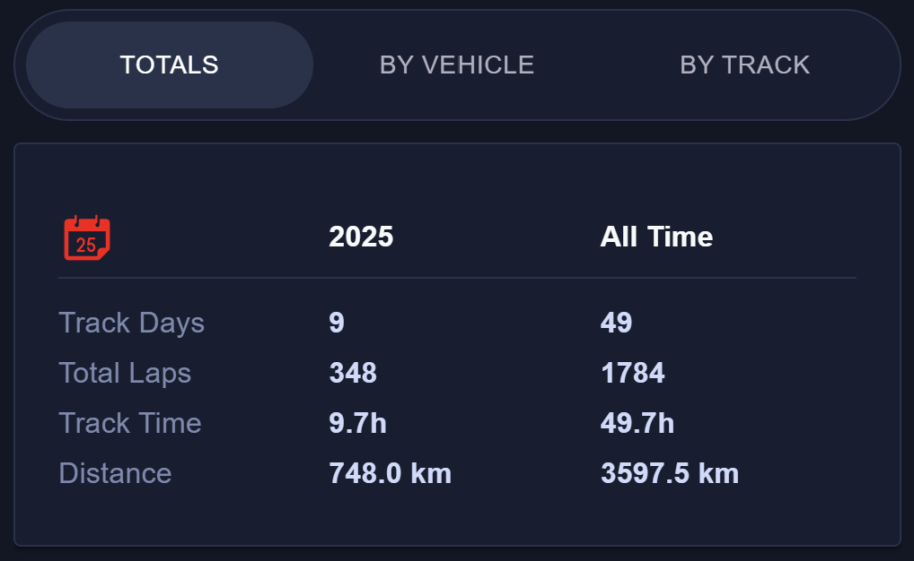
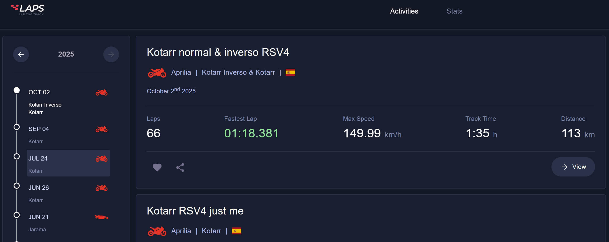
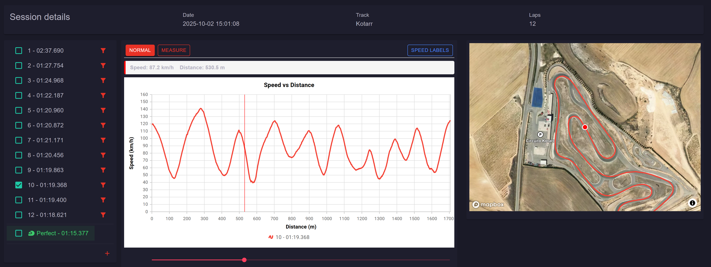
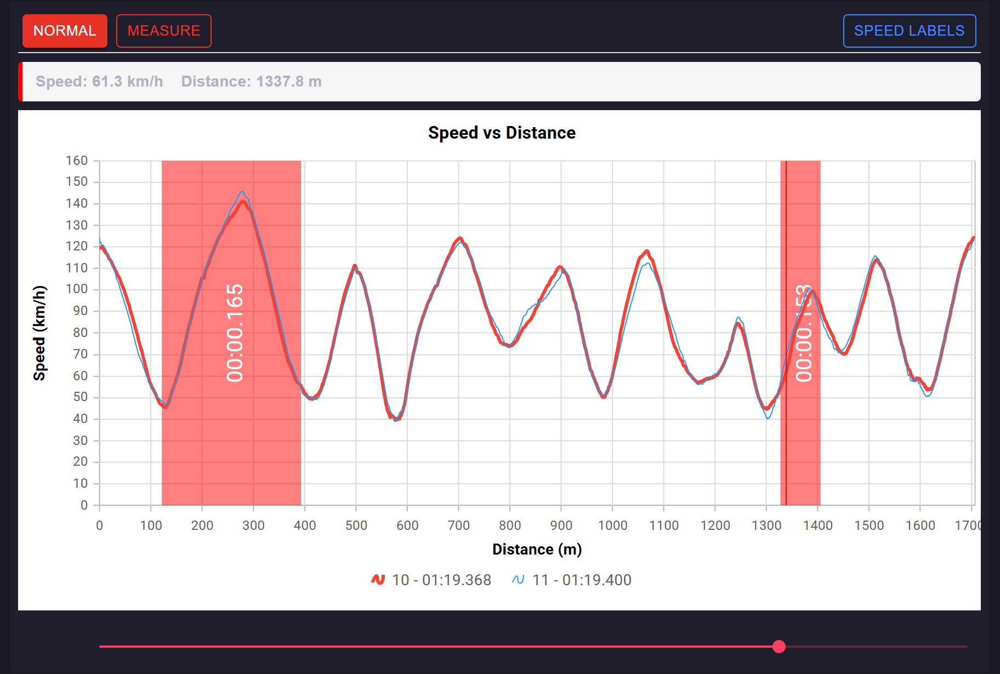
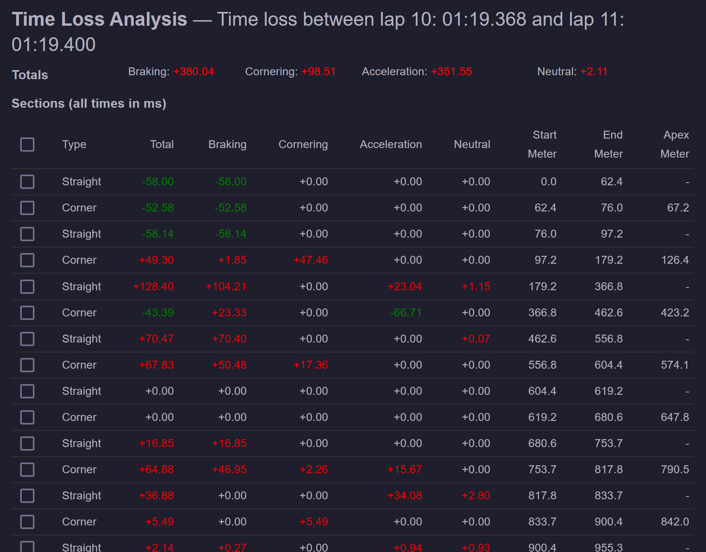
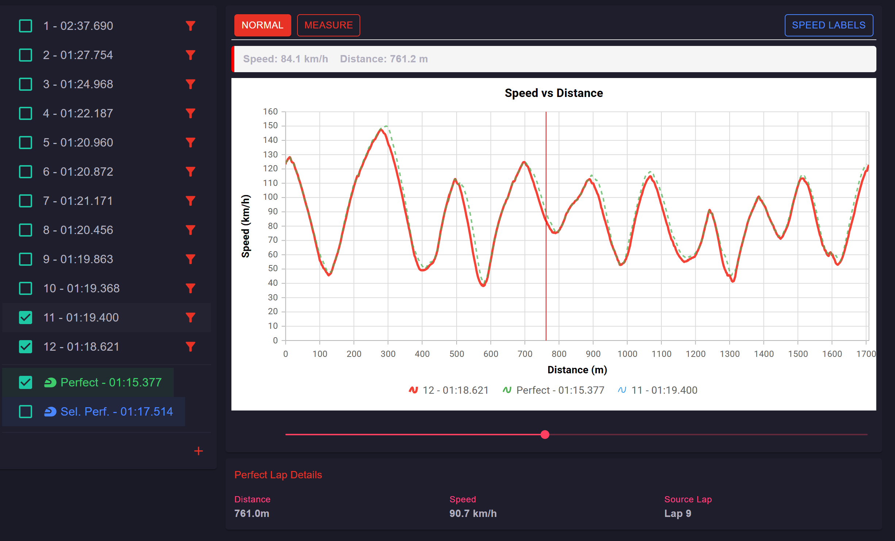

I'm an occasional track day driver and rider. I'm not any good at it, but I enjoy track days. I've done a bunch over the last few years, especially with motorbikes. And of course, just like I can't go mountain biking without tracking it on Strava, no track day goes without all possible telemetry recorded somewhere.

The *somewhere* was the problem. There are a bunch of dedicated hardware devices and apps (called lap timers) out there. I've used an AIM MyChron 5S for years, and also apps like the phenomenal Harry's LapTimer. Lately I switched to RaceChrono since I prefer it while on track. I also picked up the fantastic Racebox Mini, a 25 Hz GPS you can plug into your phone to get really accurate data.

The problem is that each lives in its own world, and it's far from easy to simply have one place to store all your laps, compare with others, and figure out how to get faster without enrolling in a master's degree. That's why — with the help of some friends — I started building [laps.racing](https://laps.racing).

## How many laps have you done this year?

Not exactly life-changing, but it's always great to know how much actual time you've spent on track after all the money spent on the vehicle, equipment, track day fees, and everything else. Here are mine for 2025:

These kinds of stats are straightforward once you upload all your data — from different devices — to a single place that can read it and crunch some numbers.

While I still have a few more sessions to upload, my all-time totals so far sit at 1,784 laps, totalling a bit under 3,600 km. I need more track time.

## Listing your track days and sessions

Pretty basic too, but so nice to just have it in one place:

From there you can drill into the details of any track day — all the sessions, and then all the laps within each session.

## Details of a session

This is still far from complete, but it's where things start to get interesting. We recently implemented the typical speed-over-distance view that every analysis tool has:

So far nothing crazy, except that it's very easy to overlay laps from other sessions — probably a bit easier than in other tools I've used.

## Analysis magic — finding improvement opportunities

Figuring out how to go a bit faster, when you're just an amateur, is not that easy. You can spend a fortune on coaches (and they're worth it), but at some point it helps to actually understand the data.

The problem is that the data can be quite counter-intuitive if you're not a race engineer.

The first thing I wanted to figure out when comparing two laps was *where am I losing time?* Yes, comparing the charts is "easy", but truly understanding where most time is lost is not. That's why we came up with this analysis:

Looking at two overlapping charts doesn't immediately tell you which zones of the track cost you the most time. But this simple calculation finds exactly those zones, letting you focus on what matters. And very often it's not "just corner faster" — most of the time, for amateurs, time is lost simply braking too early or not accelerating hard enough. Easy to fix once you spot it, but hard to spot in the first place.

## Curve-by-curve analysis

This is my favourite so far, and it's a natural consequence of the previous one: what if you split the track corner by corner, straight by straight, and calculate how much time you lose or gain on each?

Here we go. The visuals are still work in progress, but the information is already quite valuable:

It helps you focus on where the biggest problems are, which as an amateur is much harder than you might think — unless you're a gifted rider or driver already operating at another level.

## Perfect lap calculation

Typically a "perfect lap" just combines your best sectors. You divide the track into three or four sectors and take the best time from each. It makes a lot of sense, but we wanted to push further and figure out what *really* perfect would look like. What if you split the lap into a ton of small sections?

This visualization shows exactly that. Of course it might not be entirely realistic, but it tells you where each "best" section comes from, so you can judge whether it's something you can actually improve — or if it's impossible (like that time you hit your best-ever top speed but ran off the track... which makes for a great "ideal lap" but is hard to repeat).

## What's next

I still don't know exactly how this will evolve. I'm certainly using it every track day, and we have tons of ideas — better analysis (or at least analysis that's more understandable to mere humans), personal track records, comparisons with other drivers, and maybe even a way to share your data with a coach so they can give you better feedback based on actual telemetry instead of just what you remember from the session.

If you're into track days and want to try it out, check out [laps.racing](https://laps.racing).
