> *This post was originally published in Spanish on [Medium](https://medium.com/@psluaces/merges-desmitificados-fb6a1cbc3807).*

(Este blogpost está disponible en Español [aquí](/posts/merges-desmitificados/)).

Merging is easy if you know two things:

1.  There are 3 versions of the file you are merging involved.
2.  How one of those 3 versions (the ‘how it was before the changes’) is chosen, since the other two are obvious.

### Why this now?

It is 2025 and merges are still a pain, and most tools don’t make them easy.

### There are 3 versions involved, nothing more

You and I touch the same file, and we compare them. They look like this:

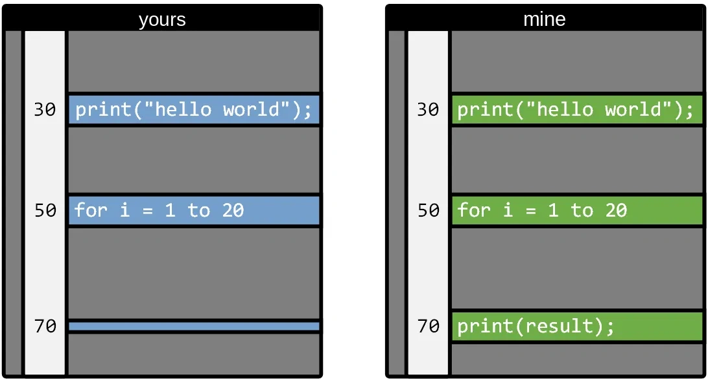

Did you delete line 70? Or did I add it?

There is no way to know (unless we have a very good memory).

If, when merging files, we simply compared your version with mine, every change would be a conflict, a question, something to resolve, a nightmare (that’s how merges were with Subversion, and CVS, and other things from the archaeology of version control).

But, if we know how the file was before, things get simpler. Between your file and mine I put how it was before our changes:

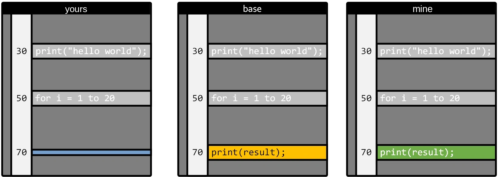

Now it is easy, right? It is clear that you deleted line 70.

A decent mergetool wouldn’t even ask: this is an automatic merge conflict.

### On ‘common ancestor’ or ‘base’

The ‘how it was before our changes’ version of our file goes by several names, and they are always a bit convoluted so this looks serious. Base, common ancestor, things like that.

Any self-respecting version control knows how to find it (whichever one you are using knows).

You must be very clear that there are always 3 elements:

-   Your copy of the file in the branch you are merging to.
-   The copy of the file in the branch you are merging **from**.
-   How that file was **before** the changes.

Then version controls will call this different things, to complicate your life:

-   Your copy: mine, destination.
-   The copy you merge from: source, yours (I never quite understood this one).
-   How it was before the changes: **base**, **common ancestor**.

### Non-automatic merges

Sometimes this happens, and then merge tools need a human to decide:

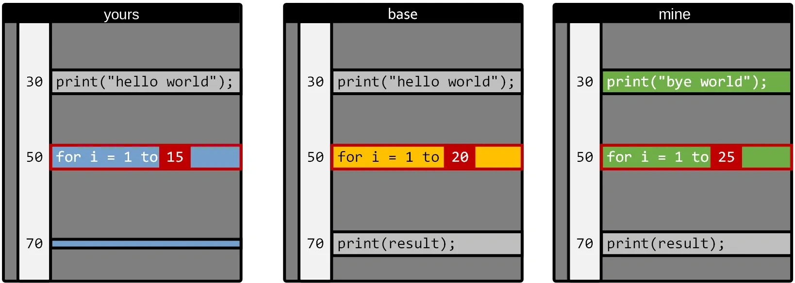

You put a 15 on line 50 where there used to be a 20, and I put a 25.

This is what is called a ‘manual conflict’ and it is when you have to use a mergetool, or if you don’t have one, that thing with >>>>>>>>>>>> that nobody understands.

But the concept is simple: either you pick one of the 3 options:

-   Leave it as it was.
-   My changes.
-   Yours.

Or you adapt it by hand.

Nothing more, that is a merge.

If it is harder than this, look up how to install a good mergetool in your Git (there are many, although it is a bit sad that at this point nothing good comes installed out of the box, yes).

By the way, the changes on lines 30 and 70 will be automatic => it will keep my ‘bye world’ and delete line 70. No conflict.

### How to know how the file was before our changes?

Let’s see it with a very simple case, with just two branches:

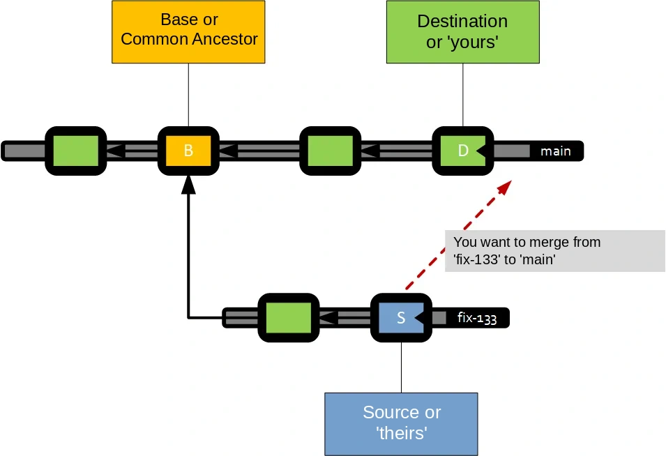

You can picture this ‘vertically’ if you have always used Git, but I like it better this way.

In the end, version control tracks every _commit_ you make, and knows ‘who its father is’ (like Darth Vader) and how everything evolves.

So when you want to merge from fix-133 to main, the system walks the graph and finds the node where both paths collide. In this case the commit marked with a B.

Since this is a graph, that common point is called the common ancestor.

And that’s where ‘the base’ of the merge comes from, the ‘how it was’.

Very easy:

1.  The copy ‘you merge to’ in this case is whatever is in ‘D’.
2.  The copy ‘you merge from’ is the one in ‘S’.
3.  And the how it was, is in B.

If you merged from ‘main’ to your branch, the ‘source’ and ‘destination’ would be swapped, the base would be the same.

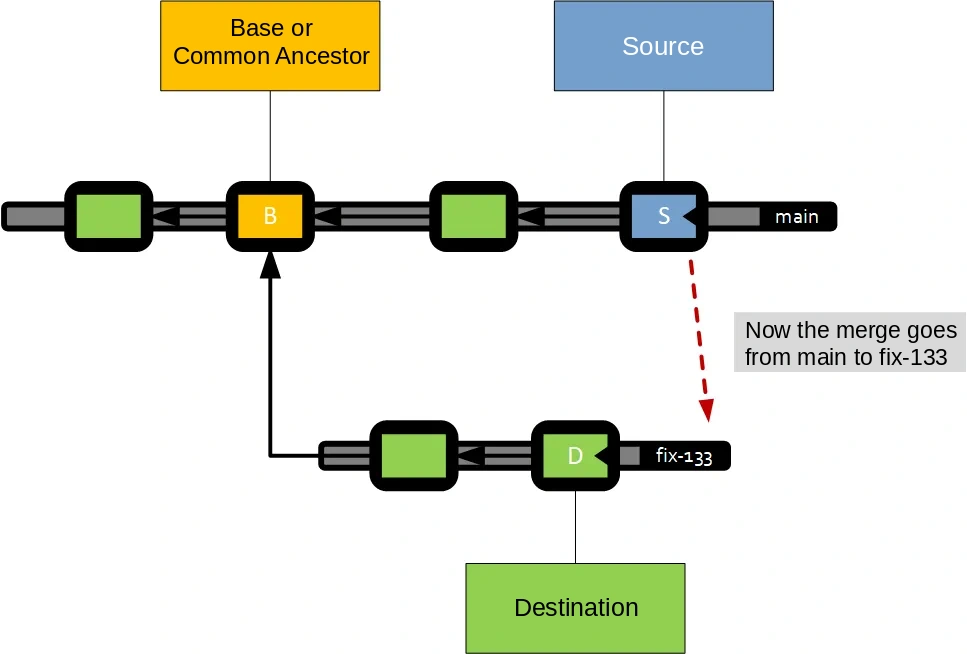

### The problems grow

In a repository with many people and many commits, sometimes finding the ‘common ancestor’ is not that simple, and it can be much further away.

In this example it is already a bit harder, would you know where the ‘base’ of this merge will come from?

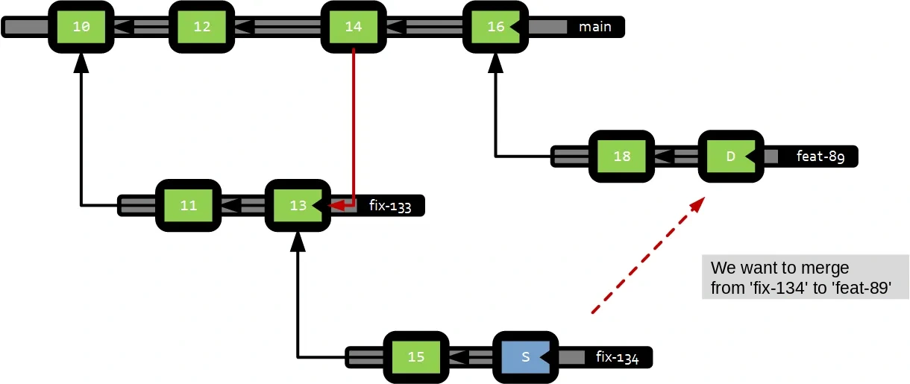

Well, it is commit 13, because that ‘merge link’ (red line between 14 and 13) makes 13 the closest common point.

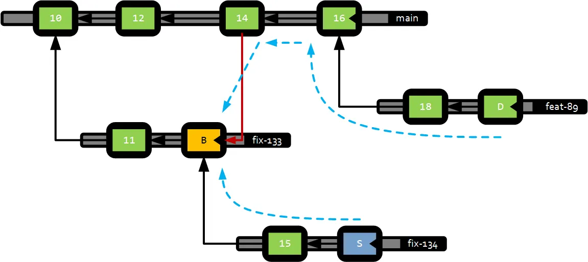

It can get as complicated as you want, but that is why Git and other tools store the ‘merge links’ and know how to calculate this very well.

### No matter how many files you have, the ‘how it was’ comes from the same commit

All modern version controls use a graph like the one we have shown, so even if you touched 1300 files in the branch, to find their ‘how they were’ it will use the same common commit for all of them.

Version controls like Perforce (if you are in video games it will ring a bell) use a different technique, which has pros and cons, but I’m not going to get into that.

### There is no magic

So it is not that Git magically remembers ‘what you have merged’. It only uses the merge links to know what has been merged and what hasn’t. Nothing more. There is no more magic than this.

(There is, but in other systems like Darcs and things like that, which are rarely used, despite their potential.)

### How to break history

Now that you know how a merge works, let’s see how to mess it up (so you don’t do it).

-   You are quietly working on your branch.
-   But for whatever reason, you have to bring in changes from ‘main’.
-   And for some reason (because you already touched that file, for example) the merge tool pops up.
-   And you decide that a piece of code that comes from main because someone put it there, is of no interest to you.
-   So you delete it.
-   It will get sorted out when they merge my branch to main, you think.
-   Nope. It doesn’t work like that. You just wiped out a nice piece of code and messed it up.

Let’s see why, with drawings.

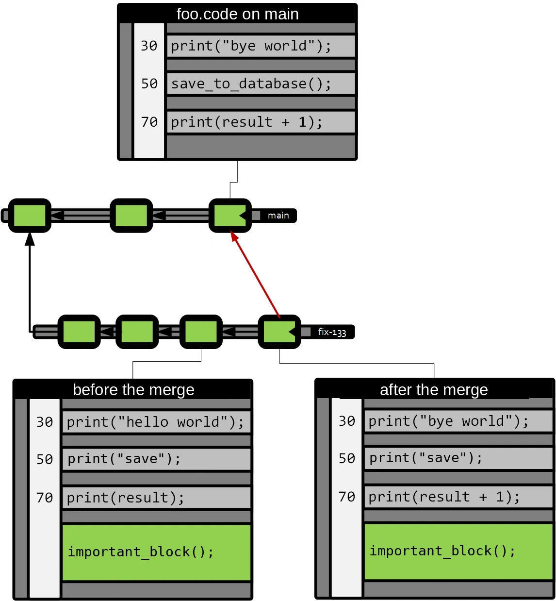

After the merge you kept your changes (important\_block()), and you brought in the changes from ‘main’ on lines 30 and 70 (print(“**bye** world”) and print(result **\+ 1**)).

But, for whatever reason, you decided not to keep ‘save\_to\_database()’ thinking that the magic of the merge will save the situation later on.

So you keep working on your branch, and a while later that branch has to go into main, and the situation looks like this:

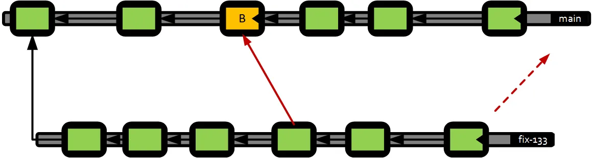

Since your version control ‘remembers’ the merges, now the base of your merge is the commit marked in orange.

And what happens to your file? Let’s see: I’m going to assume that in main there is only one additional change to the file on line 30 (easy) and in your case you kept changing things in the final block, which I now call block\_2.

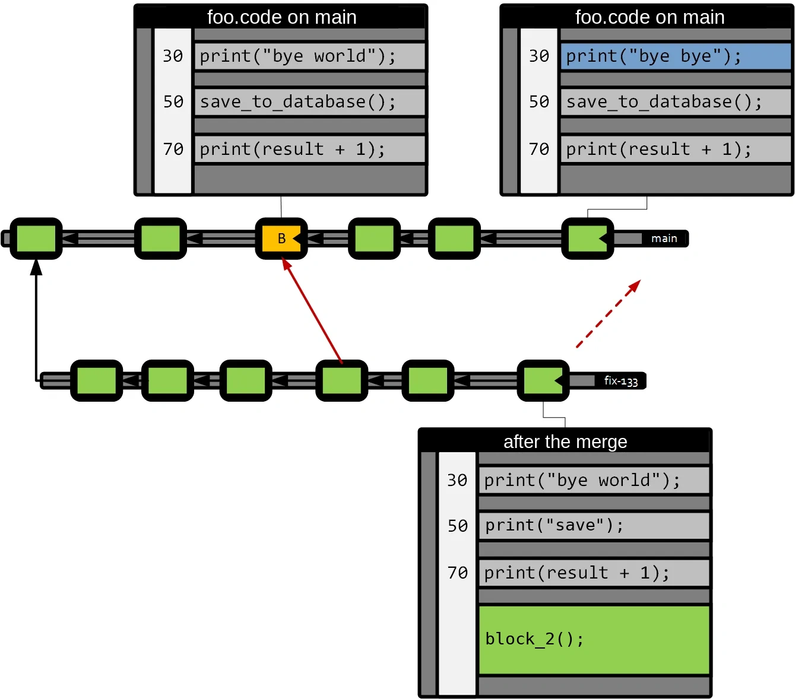

What will happen during the merge? Let’s put the files ‘in order’ with the base in the middle, to see what conflicts there are.

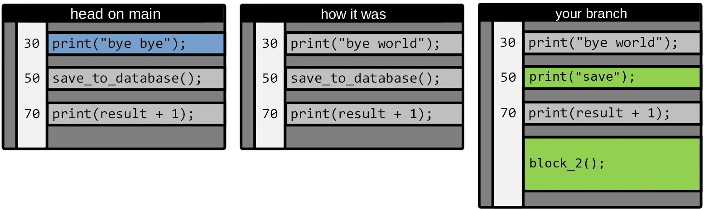

The new change on line 30 in main goes in without conflict (there are no changes in the other two contributors).

Your “print(“save”)” on line 50 ‘wipes out’ the save\_to\_database() (which looks important) because that is what you decided in the previous merge.

And your block\_2() will also go in automatically.

That is, you have “lost” the ‘save\_to\_database’ because you deleted it in the previous merge.

I understand that for many this is nothing new, but what I want to make clear is that neither Git nor other version controls (Diversion, Perforce, Plastic SCM, Mercurial) do ‘anything else’ to understand merges, other than finding the base and comparing the 3 versions involved. They don’t remember intermediate decisions other than this way.
