> *This post was originally published on [Medium](https://medium.com/@psluaces/merges-desmitificados-fb6a1cbc3807).*

Hacer merges es fácil si sabes dos cosas:

1.  Que hay 3 versiones del fichero que estás _mergeando_ implicadas.
2.  Cómo se elige una de esas 3 versiones (el ‘cómo estaba antes de los cambios’), ya que las otras dos son obvias.

### ¿Por qué esto ahora?

Es 2025 y los merges siguen siendo un dolor, y la mayoría de herramientas no lo hacen fácil.

### Hay 3 versiones implicadas, nada más

Tú y yo tocamos un mismo fichero, y los comparamos. Tienen esta pinta:

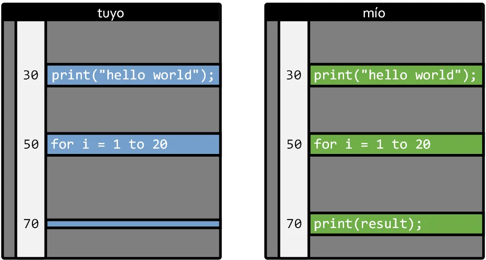

¿Has borrado tú la línea 70? ¿O la he añadido yo?

No hay forma de saberlo (a menos que tengamos muy buena memoria).

Si al _mergear_ ficheros simplemente comparamos tu versión con la mía, cada cambio sería un conflicto, una pregunta, algo a resolver, una pesadilla (así eran los merges con Subversion, y CSV y otras cosas de la arqueología del control de versiones).

Pero, si sabemos cómo era el fichero antes, las cosas se simplifican. En el medio de tu fichero y el mío pongo cómo era antes de nuestros cambios:

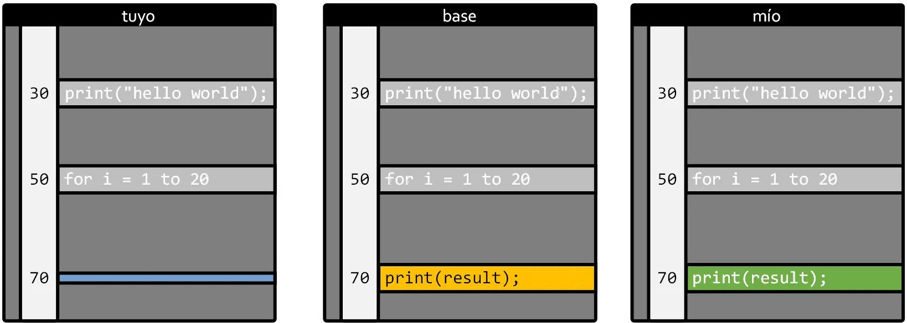

Ahora es fácil, ¿no? Está claro que tú borraste la línea 70.

Una mergetool decente ni preguntaría: esto es un conflicto de merge automático.

### En ‘antecesor común’ o ‘base’

A ‘cómo estaba antes de nuestros cambios’ nuestro fichero se le da varios nombres, y siempre son un poco rebuscados para que esto parezca serio. Base, antecesor común, cosas así.

Cualquier control de versiones que se precie sabe cómo encontrarlo (cualquiera que estés usando lo sabe).

Tienes que tener muy claro que siempre hay 3 elementos:

-   Tu copia del fichero en la rama a la que estás haciendo merge.
-   La copia del fichero en la rama **desde** la que estás haciendo merge.
-   Cómo estaba ese fichero **antes** de los cambios.

Luego los controles de versiones llamarán a esto de diferentes formas, para complicarte la vida:

-   Tu copia: mine, destination.
-   La copia desde la que mergeas: source, yours (esto nunca lo he entendido bien).
-   Cómo estaba antes de los cambios: **base**, **common ancestor**.

### Merges no automáticos

A veces pasa esto, y entonces las herramientas de merge necesitan a un humano que decida:

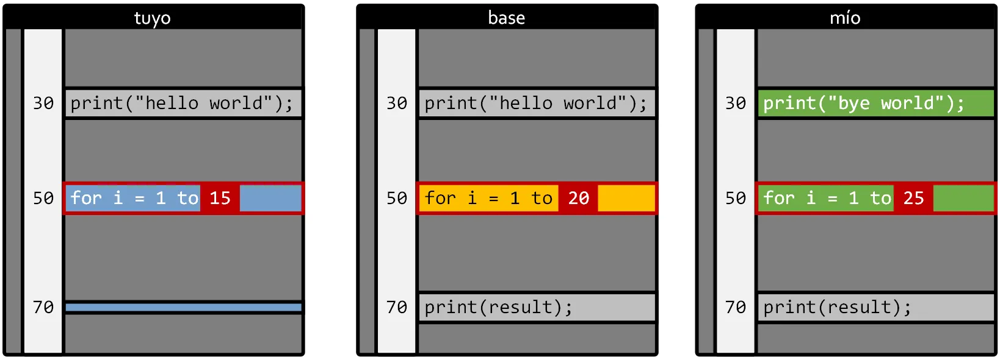

Tú has puesto un 15 en la línea 50 donde antes había un 20, y yo he puesto un 25.

Esto es lo que se llama ‘conflicto manual’ y es cuando tienes que usar una mergetool, o si no tienes, esa cosa con >>>>>>>>>>>> que nadie entiende.

Pero el concepto es sencillo: o bien elijes una de las 3 opciones:

-   Dejaro como estaba.
-   Mis cambios.
-   Los tuyos.

O bien lo adaptas a mano.

Nada más, eso es un merge.

Si es más difícil que esto, busca cómo instalarte una buena mergetool en tu Git (hay muchas, aunque da pereza que a estas alturas no venga algo bueno instalado de serie, sí).

Por cierto, los cambios en las líneas 30 y 70 serán automáticos => se quedará con mi ‘bye world’ y borrará la línea 70. No hay conflicto.

### ¿Cómo saber cómo estaba el fichero antes de nuestros cambios?

Vamos a verlo con un caso muy sencillo, con dos ramas nada más:

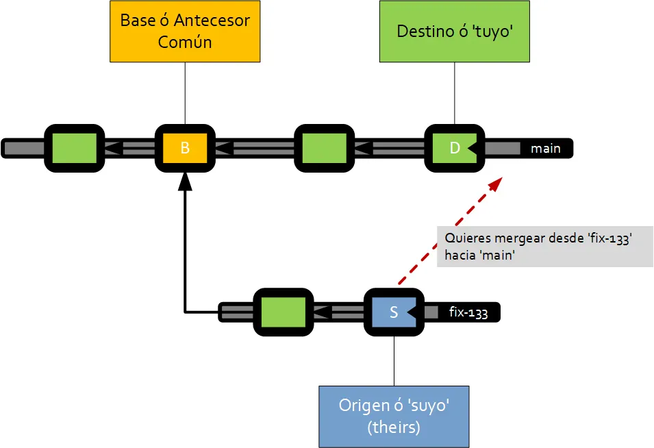

Puedes imaginar esto en ‘vertical’ si siempre has usado Git, pero a mí me gusta más así.

Al final el control de versiones controla cada _commit_ que haces, y sabe ‘quién es su padre’ (como Darth Vader) y cómo evoluciona todo.

Así que cuando quieres hacer un merge desde fix-133 a main, el sistema recorre el grafo y encuentra el nodo en el que ambos caminos colisionan. En este caso el commit marcado con una B.

Como esto es un grafo, a ese punto común se le llama antecesor común.

Y de ahí sale ‘la base’ del merge, el ‘cómo estaba’.

Muy fácil:

1.  La copia ‘hacia la que mergeas’ en este caso es lo que esté en ‘D’.
2.  La copia ‘desde la que mergeas’ es la que está en ‘S’.
3.  Y el cómo estaba, está en B.

Si hicieras merge desde ‘main’ a tu rama, el ‘origen’ y ‘destino’ estarían al revés, la base sería la misma.

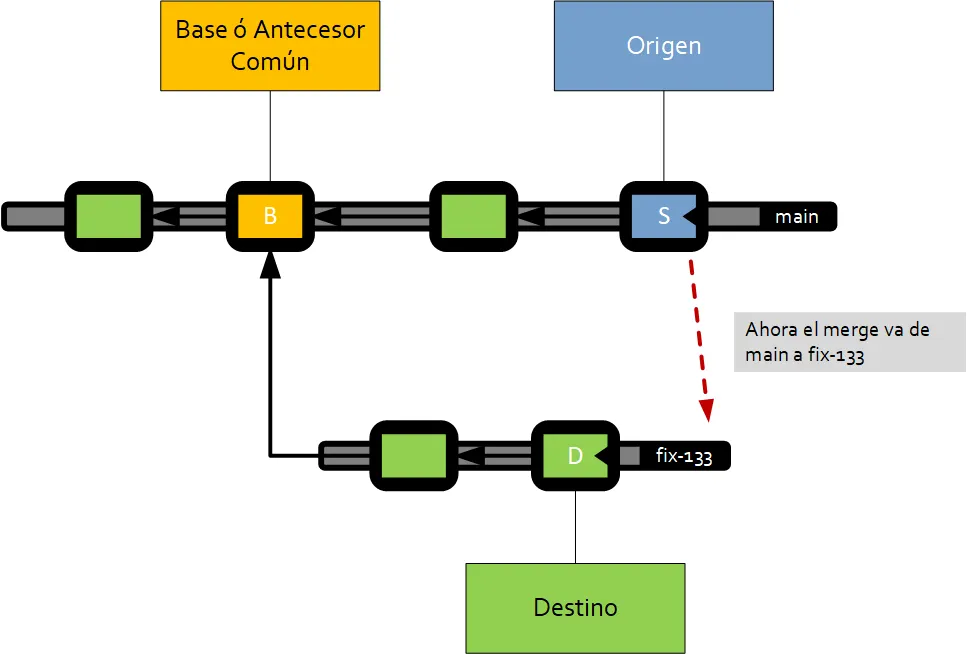

### Los problemas crecen

En un repositorio con muchas personas y muchos commits, a veces encontrar el ‘common ancestor’ no es tan sencillo, y puede estar mucho más lejos.

En este ejemplo ya es un poco más difícil, ¿sabrías de dónde saldrá la ‘base’ de este merge?

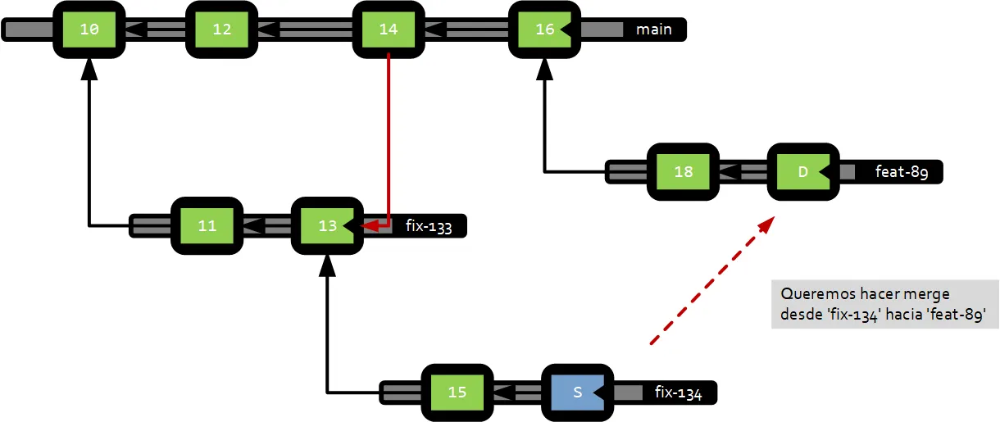

Pues es el commit 13, porque ese ‘link de merge’ (línea de color rojo entre 14 y 13) hace que el 13 sea el punto común más cercano.

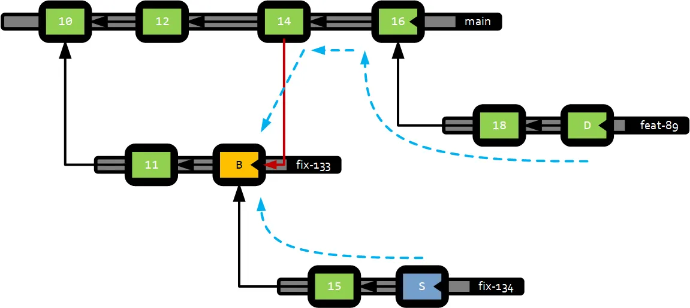

Se puede complicar todo lo que quieras, pero para eso Git y otras herramientas, guardan los ‘links de merge’ y saben calcular esto muy bien.

### Da igual cuántos ficheros tengas, el ‘cómo estaba’ sale del mismo commit

Todos los controles de versiones modernos usan un grafo como el que hemos mostrado, de modo que aunque hayas tocado 1300 ficheros en la rama, para encontrar sus ‘cómo estaban’ usará para todos ellos el mismo commit común.

En controles de versiones como Perforce (si estás en videojuegos te sonará) usan otra técnica, que tiene pros y contras, pero no voy a entrar ahí.

### No hay magia

Así que no es que Git recuerde ‘lo que has mergeado’ de forma mágica. Únicamente usa los links de merge para saber lo que se ha mergeado y lo que no. Nada más. No hay más magia que esta.

(La hay, pero en otros sistemas como Darcs y cosas así, que se usan poco, a pesar de su potencial).

### Cómo romper la historia

Ahora que ya sabes cómo funciona un merge, vamos a ver cómo liarla (para que no lo hagas).

-   Estás trabajando tranquilamente en tu rama.
-   Pero por el motivo que sea, te tienes que traer cambios de ‘main’.
-   Y por algún motivo (porque tú ya has tocado ese fichero, por ejemplo) te sale la herramienta de merge.
-   Y decides que un trozo de código que viene de main porque alguien lo metió ahí, no te interesa.
-   Así que lo borras.
-   Ya se arreglará cuando mergeen mi rama a main, piensas.
-   Nope. No va así. Te acabas de cargar un bonito trozo de código y la has liado.

Vamos a ver el por qué, con dibujos.

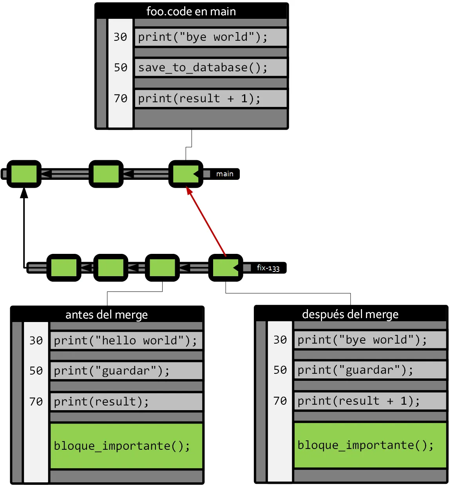

Después del merge te has quedado con tus cambios (bloque\_importante()), y te has traído los cambios de ‘main’ de las líneas 30 y 70 (print(“**bye** world”) y print(result **\+ 1**)).

Pero, por lo que sea, has decidido no quedarte con ‘save\_to\_database()’ penando que la magia del merge salvará la situación más adelante.

Así que sigues trabajando en tu rama, y un rato más tarde esa rama debe entrar en main, y la situación es como esta:

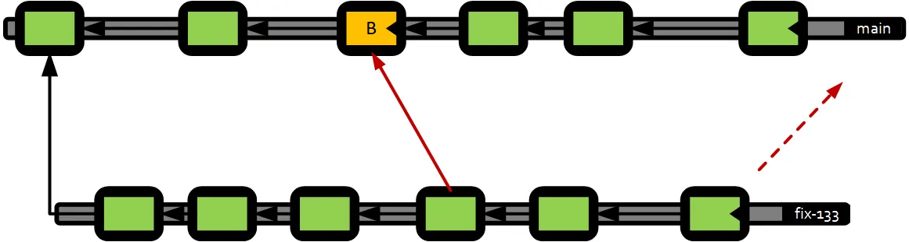

Como tu control de versiones ‘recuerda’ los meges, ahora la base de tu merge es el commit marcado en naranja.

¿Y qué ocurre con tu fichero? Vamos a verlo: voy a suponer que en main sólo hay un cambio adicional sobre el fichero en la línea 30 (fácil) y en tu caso has seguido cambiando cosas en el bloque final, que ahora llamo bloque\_2.

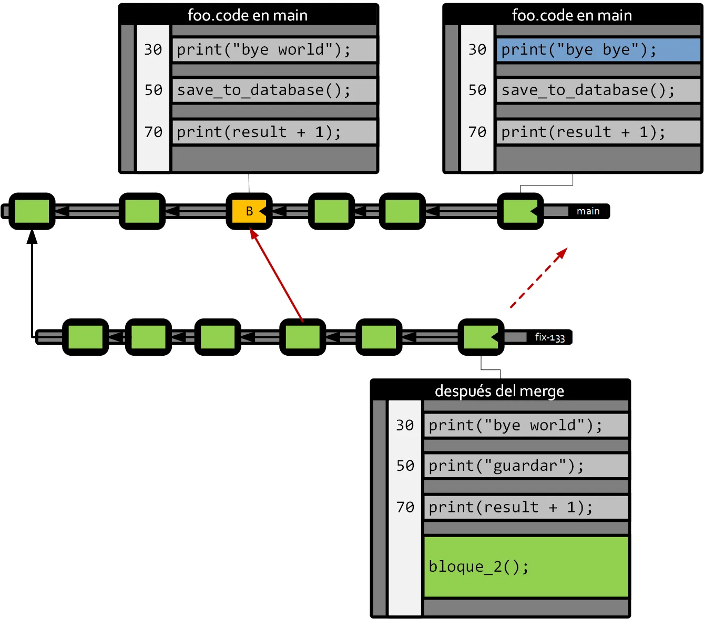

¿Qué pasará durante el merge? Vamos a poner los ficheros ‘en orden’ con la base en el medio, para ver qué conflictos hay.

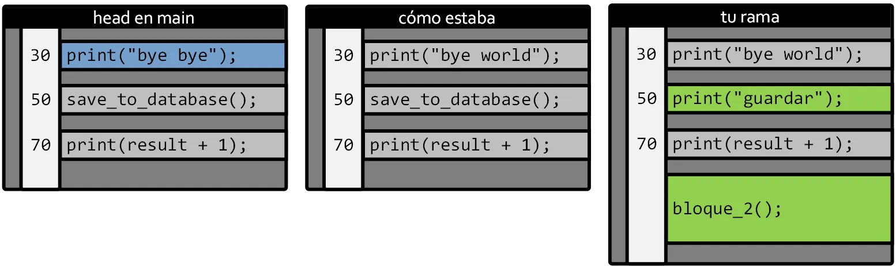

El nuevo cambio en la línea 30 en main entra sin conflicto (no hay cambios en los otros dos contribuidores).

Tu “print(“guardar”)” de la línea 50 se ‘carga’ el save\_to\_database() (que parece importante) porque así lo decidiste en el merge anterior.

Y to bloque\_2() entrará también automático.

Es decir, has “perdido” el ‘save\_to\_database’ debido a haberlo borrado en el merge anterior.

Entiendo que para muchos esto no es nada nuevo, pero lo que quiero dejar claro es que ni Git ni otros controles de versiones (Diversion, Perforce, Plastic SCM, Mercurial) hacen ‘nada más’ para entender los merges, más que encontrar la base y comparar las 3 versiones involucradas. No recuerdan decisiones intermedias más que de este modo.
