> *This post was originally published on [Medium](https://medium.com/@psluaces/que-hace-gmaster-diferente-git-client-e596cc3e1341).*

gmaster (abreviación de Git Master) es una GUI de Git que hemos diseñado en base a 3 conceptos: commits más fáciles, visualización de ramas mejorada y simplificar los merges.

Esos eran los objetivos cuando nos decidimos a programar un nuevo cliente Git en un mundo lleno de SourceTrees y GitKrakens (a estos sí que les dejan poner Git delante?? WTF!). Y esos tres son los diferenciadores de gmaster cuando los comparas con los demás.

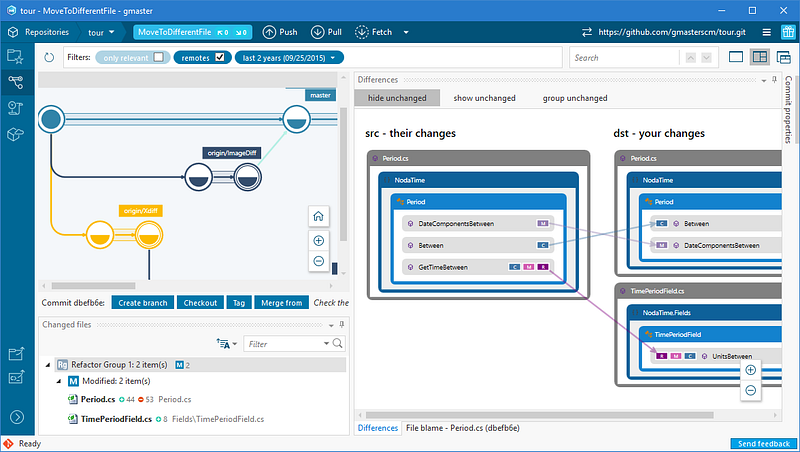

### Visualización de repositorios — todo sobre mis ramas

A ver, debo ser yo o algo, pero cuando dibujo una estructura de ramas en una pizarra nunca lo hago en vertical. Dibujo algo como esto:

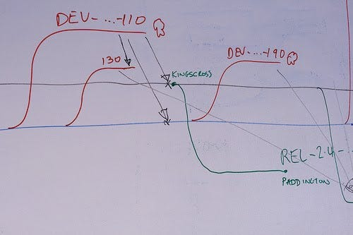

Y justo esa idea es en la que se basa el Branch Explorer de gmaster: una forma entendible de que los usuarios de Git entiendan qué está pasando con las ramas y los merges de su repo, como si alguien se lo explicara en una pizarra.

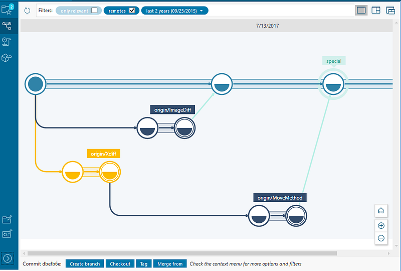

Pero algunos usuarios nos dijeron que el dibujo en vertical de otras GUIs era más compacto y que era mejor para recorrer los commits viendo los comentarios. Para resolverlo hicimos un par de cosas.

Primero que el Branch Explorer viene con un diff (mira el dibujo de debajo, que además en este caso muestra el diff de imágenes :-O), y con propiedades del commit para ver qué es cada uno cuando haces click en ellos.

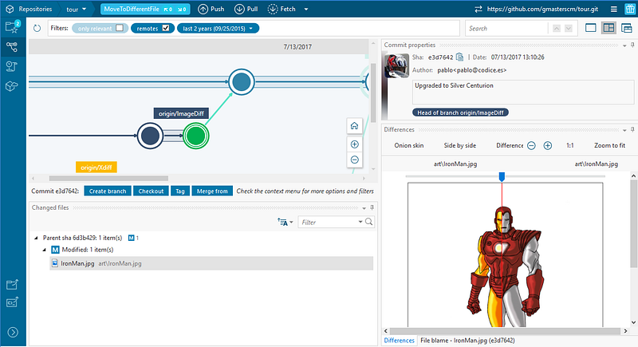

También hay un popup con info del commit cuando pasas por encima de una de los círculos (commits! :P).

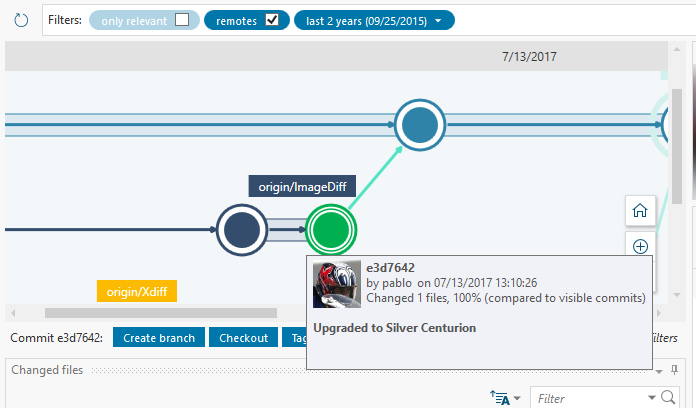

En segundo lugar, para los hardcores de la visualización en lista, dimos nuestro brazo a torcer y añadimos una “lista de commits”:

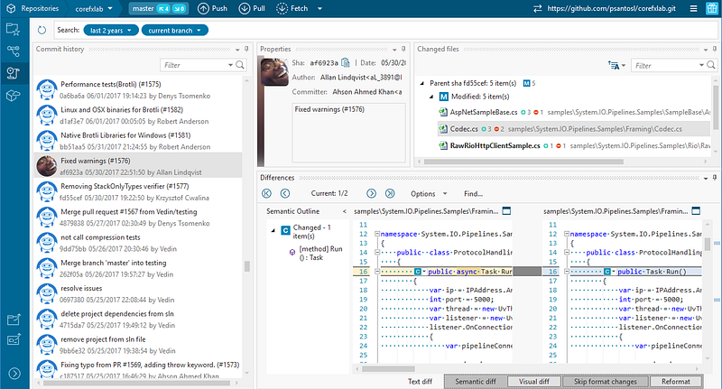

Pero hay más cosas que añadimos al Branch Explorer para simplificar la visualización. Mi favorita es la de “filtrar commits relevantes”. Mira esto:

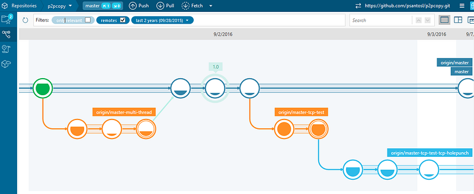

Es mi repositorio “p2pcopy”, pero ahora puedo darle a “compactar” y el gráfico se collapsa eliminando los commits no relevantes para la topología, que son los que no reciben un merge, no son inicio ni fin de rama y no están etiquetados:

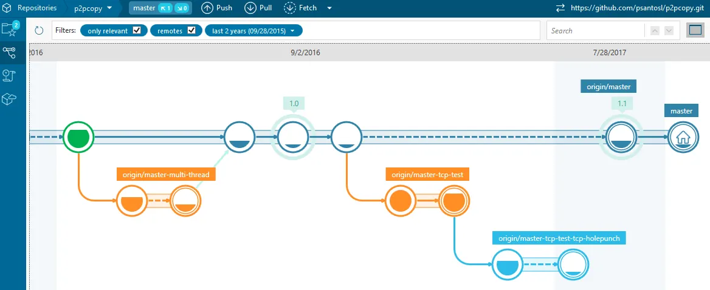

Ahora el grafo es más comapcto que antes, y me deja ver más de la evolución de las ramas en el mismo espacio.

Y la otra cosa importante es el filtrado. Puedo darle al botón derecho y decir “filtra las ramas seleccionadas y las relacionadas”:

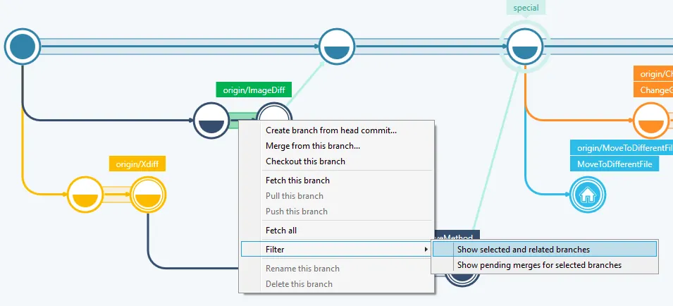

Y entonces pasa esto de abajo, y te centras solamente en las ramas que querías:

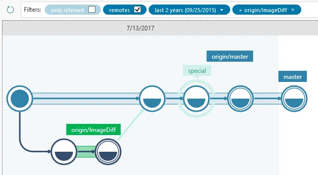

Para terminar, es muy importante que todas las operaciones de “branching y merging” se pueden hacer desde el Branch Explorer de forma muy visual. Crear ramas, hacer merges, cherry-pick… de todo:

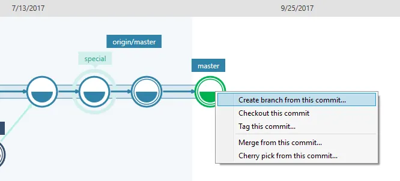

Eso sí, no sé qué pasa, pero muchos usuarios ya no usan jamás el botón derecho, y tenemos a gente que no encuentra estas opciones, así que estamos dándole vueltas para ver cómo hacemos que todos los botones estén a la vista, sin menús contextuales.

### Diff y merge incluidos, y con superpoderes semánticos

Aquí viene una cosa que me fastidia cuando he usado otras GUIs de Git: ¿por qué no traen diff side-by-side? Vale, los +- de toda la vida son muy hackers pero… ¡estamos en 2018! Es que los instalas y no te traen diff, ni merge, te los tienes que bajar por separado, o comprar un Araxis o algo así.

Siempre hemos considerado que el diff y el merge eran partes fundamentales del control de versiones. Así que en gmaster hemos empaquetado unas cuantas herramientas que llevamos años desarrollando: un side-by-side diff, un merge de 3 vías de verdad, y nuestra arma secreta: diff y merge semánticos.

Voy a empezar con los más básicos primero:

-   Side-by-side diff con Xdiff (detección de bloques de texto movidos). Lo desarrollamos hace tanto que ya casi no nos acordamos de lo útil que es. Puede hacer cosas como esta:

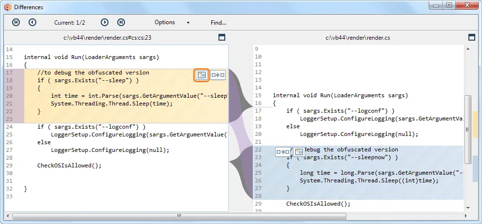

-   3-way merge con Xmerge: una herramienta de merge de 3 vías tipo WinMerge o Araxis, incluida en el producto, y también con tracking de texto movido.

Para saber más sobre cómo Xdiff y Xmerge detectan código movido, [mira aquí](https://www.plasticscm.com/features/xmerge.html).

Quitando lo de la detección de bloques movidos, tampoco es que estas dos herramientas sean nada nuevo pero es que… ¡las otras GUIs de Git no traen nada! :-)

Ahora, como dije antes, lo realmente rompedor es la tecnología semántica que llevamos años desarrollando. ¿Qué pasaría si tu herramienta de diff y merge entendiera código C# (o Java, o C++, o C…)? Eso es justo lo que hacemos, y los resultados son bastante impresionantes:

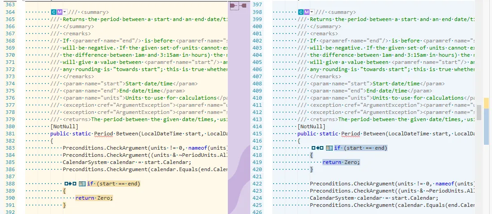

Puede “romper” el diff y poner juntas las diferencias de un método que ha sido movido a otro sitio en el mismo fichero, como puedes ver en la captura anterior, en la que las líneas no coinciden, pero Semantic \*sabe\* que el método “Between()” se ha movido (fíjate en las C y las M que decoran el método en C# y que indican cambiado y movido).

Y es que una vez que parseas el código, puedes hacer ya muchas cosas, como explicar visualmente el movido:

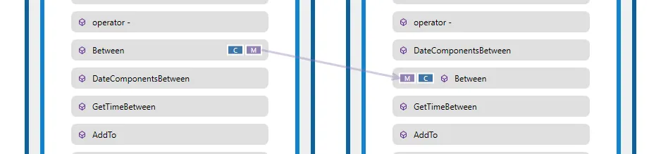

Como decía, incluimos nuestro [semanticmerge](http://www.semanticmerge.com) dentro de gmaster, pero hemos ido más allá y lo hemos convertido en multi-file. Mira esto:

¡Exacto! ¡Sabe que GetTimeBetween() se ha movido a otro fichero! Ha sido movido, cambiado y renombrado, pero gmaster lo sabe… ¿te imaginas el tiempo que esto puede ahorrar al revisar refactors complicados?

Si quieres saber más sobre los detalles de cómo va el merge multi-file [lee este blogpost](http://blog.gmaster.io/2017/09/git-refactors-there-must-be-better-way_6.html).

### Merge preview

Cuando hago un merge de una rama, la mayoría de las GUIs de Git lo único que hacen es adaptar lo que hace la línea de comandos un poco. (Algunas hasta dan un error: ¡error, hay un merge! :-O).

Nosotros queríamos hacer algo diferente, basado en nuestra experiencia previa desarrollando control de versiones.

Así que desarrollamos una “preview” separada de la típica vista de “commit”. Así cuando lanzo un merge me lleva a una interfaz específica que me ayuda a entender qué esta pasando y cómo solucionar el merge. Echa un ojo a la siguiente captura:

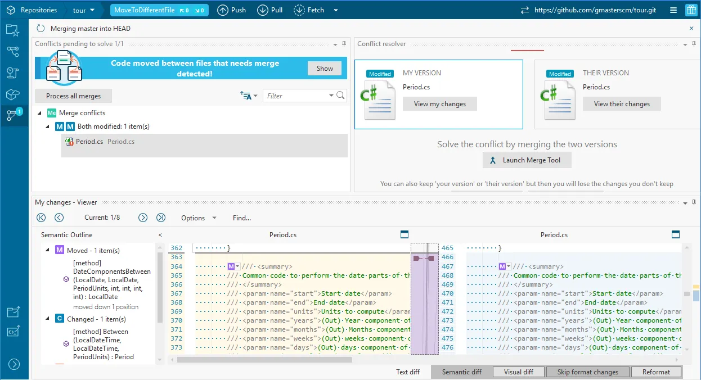

Puedes ver como gmaster me da un resumen y me dice que solo hay un fichero en conflicto, me muestra los dos contribuidores del merge (los cambios hechos en paralelo), con sus diferencias, y me deja o bien mezclarlos (merge, lo habitual) o bien quedarme con uno de ellos.

¿Ves el mensaje azul de arriba? Que dice “code moved between files detected”. Mira lo que pasa si le doy:

Este es el poder del merge multi-file (o cross-file) semántico: el método GetTimeBetween() fue movido a un fichero diferente y modificado y renombrado, pero mientras, en otra rama, alguien lo modificó en su ubicación original. gmaster puede hacer merge de eso. Esto no lo hace ninguna otra herramienta todavía.

Creo que algún día todos los merges estarán montados sobre algo como esto, pero hoy por hoy gmaster es el único que lo hace.

Más detalles [aquí](http://blog.gmaster.io/2017/09/git-refactors-there-must-be-better-way_6.html).

### Commits fáciles, sin pegarte con el índice

No todos los usuarios de Git son expertos ni quieren serlo. Y muchos se pelean con el rollo de tener que añadir al índice de Git antes de hacer commit. Y nosotros pensamos que tienen más razón que un santo. A ver, ya bastante tienes en tu día a día como para tener que hacerte un experto en otra herramienta más, para hacer algo básico.

Así que hemos intentado simplificar el commit todo lo que hemos podido: solamente te mostramos lo que ha cambiado, haces commit y listo. Nada de pasos intermedios.

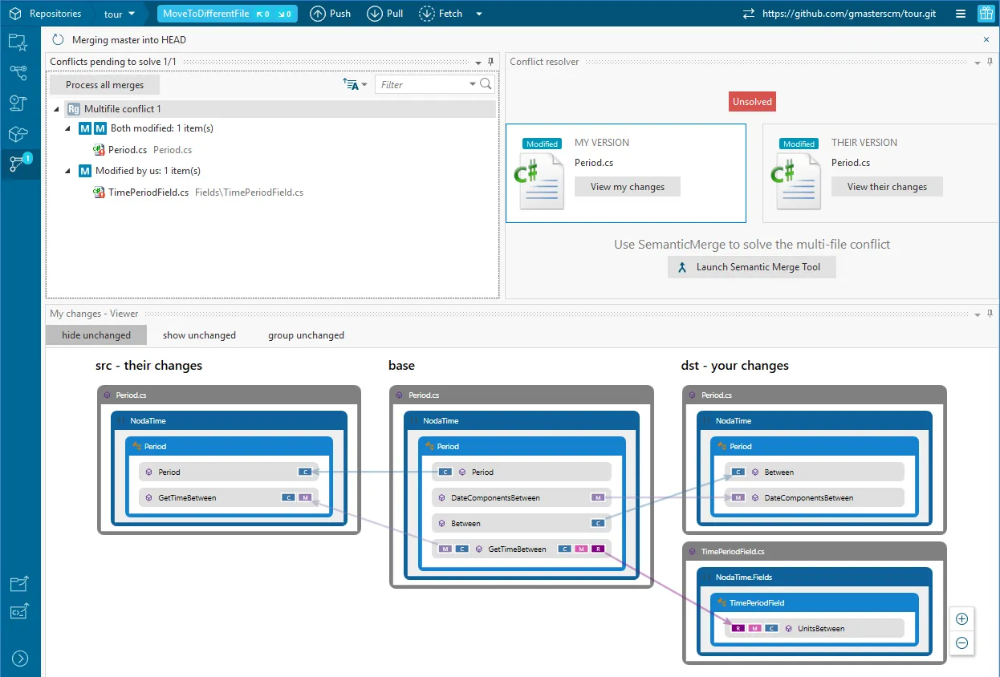

Como puedes ver en la captura, gmaster solamente te muestra los ficheros modificados, todo lo que hay que hacer es clic en “commit”.

Y tienes el dif side-by-side (con poder semántico) para ayudarte a revisar tus cambios antes de dar a commit.

Por cierto, hace poco un usuario nos dijo que echaba de menos tener ayudas para escribir los comentarios de commit, así que hemos añadido lo de título y descripción y unas guías configurables por si quieres limitar el ancho de lo que escribes.

### Primero Windows — el resto viene después

Aunque hemos programado unas cuantas [GUIs para OS X](https://www.plasticscm.com/gallery.html#macplastic) y [Linux](https://www.plasticscm.com/gallery.html#linux), la verdad es que nos sentimos mucho más cómodos en Windows.

Y esa es la única razón por la que hemos desarrollado primero una GUI de Windows. Se basa en WPF, que ya probamos durante el desarrollo de [SemanticMerge](http://www.semanticmerge.com) y con algunas partes de Plastic.

El objetivo es tener versiones OS X y Linux, pero primero queremos asegurarnos de que logramos tracción con Windows.

### GUI nativa

Como decía antes, gmaster está hecho con WPF. Queríamos tener algo nativo porque, a pesar de las desventajas en desarrollo, si lo comparas con el uso de memoria de una GUI con Electron…, sale ganando. Sí, tendremos que preparar 3 GUIS, pero espero que los usuarios agradezcan el esfuerzo.

### Para terminar

He recorrido todas las características principales de gmaster, las que realmente lo hacen diferente al resto de clientes Git.

Aquí van unos cuantos links por si quieres saber más:

-   La página de “tour”, para ver gmaster en acción. [https://gmaster.io/tour](https://gmaster.io/tour)
-   [Integración con GVFS](http://blog.gmaster.io/2017/12/how-to-use-microsoft-gvfs-with-gmaster.html), el filesystem que ha desarrollado Microsoft para poder trabajar con repositorios grandes en Git, y que soporta totalmente gmaster.
-   [Cómo integrar gmaster con JIRA](http://blog.gmaster.io/2017/11/configure-jira-with-gmaster.html) y crear ramas desde tareas.
-   Un blogpost que explica en profundidad cómo van los [merges multi-file](http://blog.gmaster.io/2017/09/git-refactors-there-must-be-better-way_6.html).

Y no te olvides de que puedes descargar gmaster de aquí [https://gmaster.io/installer](https://gmaster.io/installer).

Muchas gracias!
