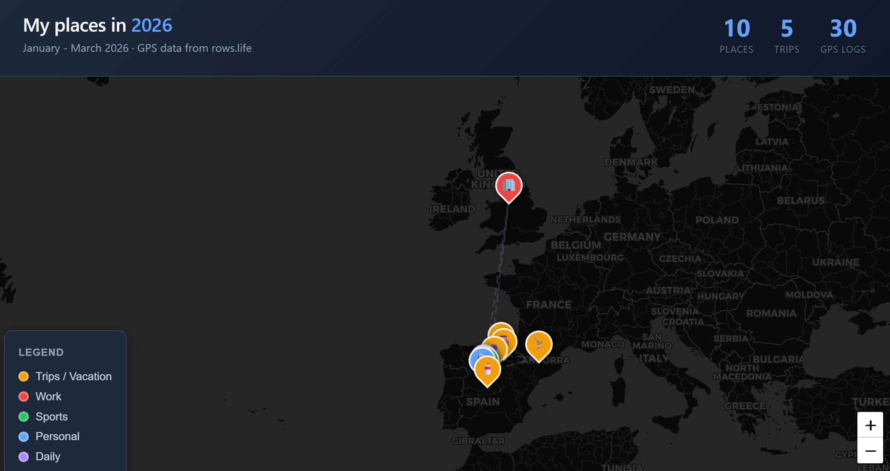

I recently wrote about how I've been obsessively tracking my time [in the 44K rows post](/posts/11-years-of-tracking/). It started back in 2014 because I wanted to know where my time was actually going. We had a custom issue tracker (called TTS), and I'd log hours against tasks — but they were hours "I thought I'd spent," not hours I'd actually tracked.

I didn't want to overthink it, so I used Excel. Years later, probably around the time I switched to macOS, I moved to Google Sheets. The problem was the sheet got so massive that searching from the app took forever. So I recently built https://rows.life and now I even have a mobile view — I can search and add notes from anywhere, not just when I'm sitting at my computer.

Let me share a few things I've learned about "writing stuff down in a time-tracked log" that might actually be useful.

## Where do you even put your notes?

I originally took notes just to track time. Something like: *scm3913: Validating the task and found an issue while doing double click.* That way I knew I'd later file that note under 'scm3913' — task 3913.

But pretty soon I started jotting down loose stuff that I'd later copy-paste into the issue tracker as an attachment. Things like why something failed, build notes, how to reproduce a bug... it didn't cost me much effort, and later when I needed to remember how to do something, I'd search the issue tracker because I vaguely remembered seeing some command in some task. Of course, I could also search "my Excel."

Then I started taking meeting notes there too. It didn't feel like the right place. I mean, Evernote back in the day, or a Google Doc later on, seemed more *proper*. But when I didn't know where to put something, I'd just dump it in "my Excel." I'd write it there first, and if I could, I'd copy-paste it somewhere better later. It wasn't the best system — not by a long shot (no formatting, no images, etc.) — but it was one obvious place to write things down... And many, *many* times I used it to figure out why we'd made some decision — "well, we agreed on such and such in that meeting."

## A personal memory system

I've been using https://rows.life for about a month now instead of my crazy excel/google-sheet setup. And of course, once it's not a clunky spreadsheet anymore, ideas start flowing. Now I can save location if I want, I have powerful search, built-in stats (pivot tables were great in Excel but not so much in Google Sheets), and I can check things from my phone. The GPS thing is nerdy, sure, but it's like "checking in" at places — and then you can search where you've been, or generate cool maps.

But the most powerful thing is that I've turned it into an MCP server (I need to write about that in detail) and now with Claude Code I can ask things like "what did I discuss with so-and-so in the last meeting" or "when did I get my tires changed." There's a local MCP server that pulls the data (which is always encrypted — only you have access to your data), computes embeddings for each entry, and then can do everything from grep-style filtering to full semantic search.

You install it in Claude Code and then you can just ask it anything, and the thing searches. Or you tell it something like:

"Make me a map with all the logged locations. Make it look nice."

And:

## All kinds of data

Beyond meetings and work stuff, you can log more personal things (use it as a diary), but also data points. For example, if you like tracking things, you can note your car's mileage at a given moment, and then ask your AI agent of choice to build you a nice chart showing how much you drive, etc.
