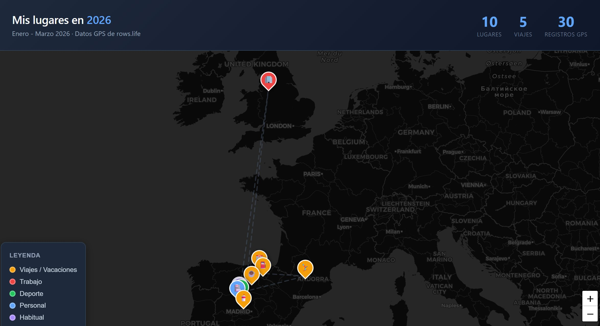

Hace poco contaba cómo llevo muucho tiempo tomando notas detalladas [en el post de las 44mil filas](/posts/11-years-of-tracking/). Empecé porque quería saber en qué se me iba el tiempo, allá por 2014. Controlaba tareas en un issue tracker custom que teníamos (TTS se llamaba), y metía horas, pero horas "que creía que había dedicado", no que realmente había trackeado.

Como no me quería complicar usé Excel. Muchos años después, creo que poco después de moverme a macOS, lo pasé a Google Sheets. El problema es que la 'sheet' era tan grande que ya ni se podía buscar desde la 'app' porque tardaba la vida. Así que hace poco hice https://rows.life y ahora tengo hasta 'mobile view' y puedo buscar y meter notas desde cualquier lado, no sólo cuando estoy delante del ordenador.

Voy a contar alguna cosa posiblemente útil de 'anotar cosas en un sitio gestionado por horas'.

## ¿Dónde dejas las notas?

Tomaba las notas sólo para controlar tiempo. Algo en plan: scm3913: Validating the task and found an issue while doing doble click. Con lo que sabía que luego tenía que meter esa nota en 'scm3913' que era la tarea 3913.

Lo que pasa es que pronto comencé a anotar cosas 'sueltas' que luego copiaba y pegaba al issue tracker (en un anexo). Cosas cómo por qué me falló algo, notas de build, cómo reproducir algo... no me costaba mucho, y luego si quería recordar cómo se hacía no sé qué, pues buscaba en mi issue tracker, porque me acordaba de que en alguna tarea había visto cómo lanzar no sé qué comando. Claro, también podía buscar en 'mi excel'.

Y luego tomaba notas también en reuniones. No me parecía el mejor sitio. Es decir, en su día un Evernote, o un docu de Google más tarde, parecía más serio. Pero cuando no sabía dónde ponerlo, pues simplemente lo dejaba en 'mi Excel'. Es más, escribía ahí, y luego si podía ser, lo copiaba y pegaba a un sitio mejor. No era el mejor sistema, ni mucho menos (por formatos, no poder pegar imágenes, etc), pero era un sitio muy claro para apuntar cosas... Y muchas, muchas veces lo usé para saber por qué habíamos decidido hacer algo "pues es que acordamos no sé qué en tal reunión".

## Sistema de memoria personal

Llevo un mes o así usando https://rows.life en vez de mi loca excel/google-sheet. Y claro, al no ser un sheet chungo, aparecen ideas. Ahora puedo guardar ubicación, si quiero, tengo unas búsquedas potentes, stats integradas (las pivot table eran guays en Excel pero en Google Sheets no tanto) y consultar cosas desde el móvil. Lo del GPS es muy friki pero es como 'hacer checkin' en sitios, y luego puedes buscar dónde has estado, o sacar mapas chulos.

Pero lo más potente es que lo he convertido en MCP (tengo que hablar sobre ello en detalle) y ahora con Claude Code le puedo preguntar cosas tipo "qué hablé con fulanito en la última reunión" o "cuándo cambié las ruedas del coche". Hay un servidor MCP local que se baja los datos (que están encriptados siempre, sólo tú tienes acceso a tus datos), calcula embeddings de cada entrada, y luego puede desde grepear y hacer filtros, a hacer búsquedas semánticas.

Lo instalas en Claude Code y claro, le puedes preguntar de todo, y el cacharro busca. O le dices algo como esto:

"Hazme un mapa con las ubicaciones localizadas, que quede bonito."

Y:

## Todo tipo de datos

Además de reuniones y cosas así, puedes apuntar cosas más personales (usarlo como diario), pero también "data points". Por ejemplo, si te gusta controlar cosas, puedes apuntar cuántos km tiene tu coche en un instante dado, y luego le pides al agente de turno que te haga un gráfico chulo con cuánto recorres, etc.
